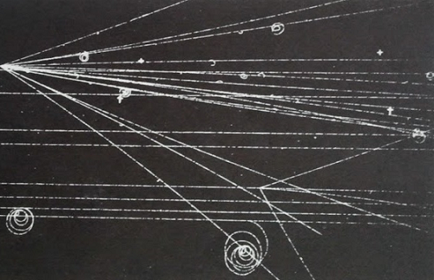
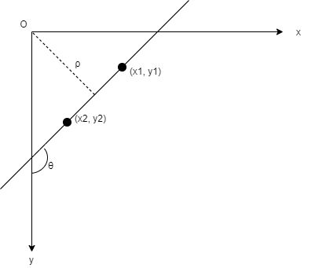
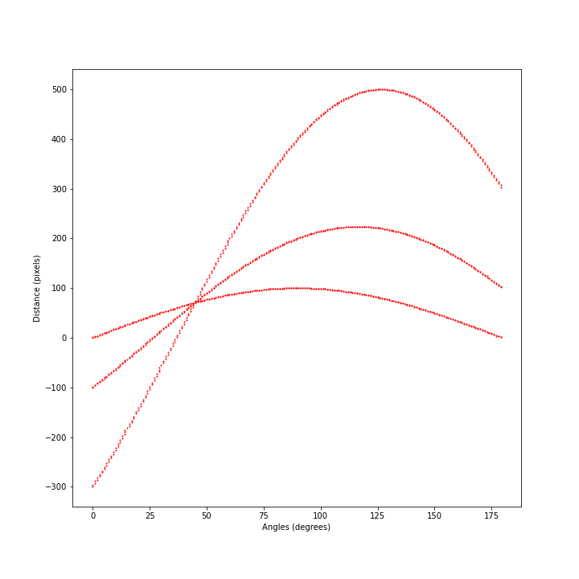
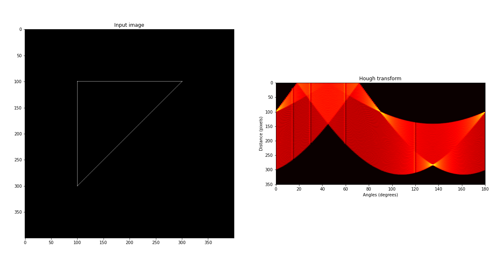
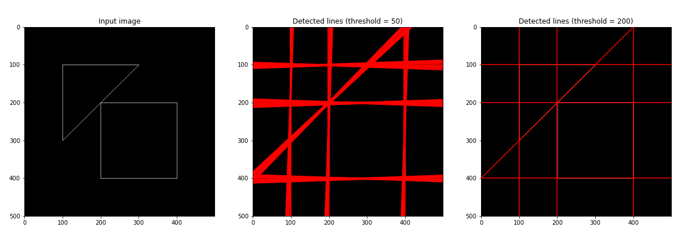
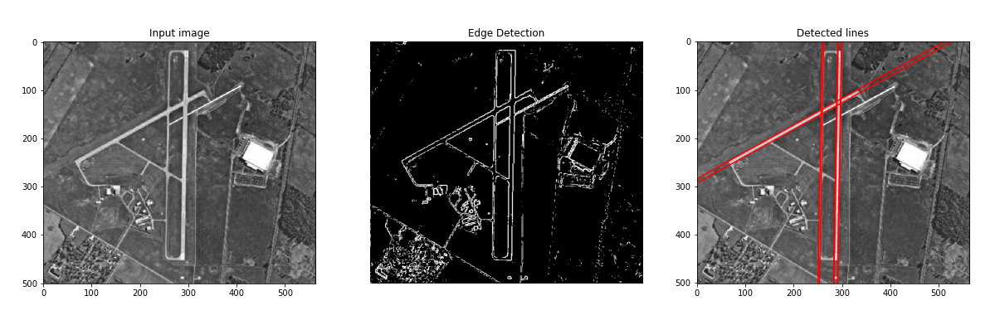

The [Hough transform](https://en.wikipedia.org/wiki/Hough_transform) is used in digital image processing and computer vision to find geometrical shapes such as lines, circles or ellipses, common in images that contain man-made objects. The Hough transform can be used after an image has been pre-processed by an edge detector to find the edges that reveal the border of objects or regions inside it. In this post I will introduce briefly the theory behind the Hough transform, and then I will present two examples , one with images containing simple geometrical shapes, to better explain the idea, and one with an image containing man-made objects. A Jupyter notebook with the Python code used to implement the functions discussed in the post and to derive the pictures shown here is available on my [GitHub repository](https://github.com/luigiselmi/datascience/blob/master/python/imaging/hough_transform.ipynb).

## Introduction
In digital image processing different filters are available that can detect edges on an image, namely regions in which the intensity value of a set of pixels along a certain direction changes steeply. These regions contain pixels that are members of real edges but also pixels that are due to noise or blurring. Often what we want to know, and what we want a computer to detect, is the shape, namely the analytical description of the object that has been revealed by the edge detector, such as the slope and intersect of a line. This further step, after the edge detection, is called edge linking and consists of connecting together the pixels that are real members of an edge of a certain shape, avoiding the pixels that have been included due to noise or blurring. The most common shape that can be found in pictures, especially those containing man-made objects, is a line. The problem can be solved by exhaustively by testing all the pixels in the edge regions. However, the computational complexity of such an approach would be proportional to the square of the number of edge pixels. Another approach was suggested in 1962 by Paul Hough, while trying to automatically determine the trajectories of charged particles crossing a bubble chamber.

The Hough method was to transform each bubble point $(x_0, y_0)$, represented by a pixel in the image, and the set of all possible lines $y_0 = sx_0 + d$ passing through it, into a line in a parameter space $(s, d)$ whose variable were the slope $s$ and the intercept $d$ with the y axis. If two points in the image belong to the same line, their representations in the parameter space must intersect for a certain value of the slope $s$ and the intercept $d$. We can therefore solve the problem of finding a line that goes through a certain number of pixels in the image by solving the problem of finding the point in the parameter space where the lines that represent each pixels intersect. The more lines intersect in a specific point $(s_0, d_0)$ of the parameter space, the more pixels in the image belong to the same line with slope $s_0$ and intersect $d_0$. The point in the parameter space that lies at the intersection of a high number of lines represents the most "voted" line in the image. Since the linear parametrization is unbounded for vertical or near vertical lines, a different transformation was introduced by [Duda and Hart](https://www.cse.unr.edu/~bebis/CS474/Handouts/HoughTransformPaper.pdf) that uses as parameters the orientation angle $\theta$ and the distance $\rho$ from the origin of the coordinates system to represent the set of lines that can pass through a pixel. We can derive the normal form of a line by computing the slope and the intercept in the frame of reference that is commonly used for images where the origin is on the upper left corner, with the y axis pointing downward and the x axis pointing to the right.

From the diagram we can easily derive the expressions of the slope s and the intercept d for the equation of a line $y = sx + d$

$$s = \frac{y_2 - y_1}{x_2 - x_1} = \frac{cos(\theta)}{sin(\theta)}$$

and

$$d = \frac{\rho}{sin(\theta)}$$

so that we can represent the set of lines passing through a pixel at $(x_0, y_0)$ with the expression

$$ \rho = -x_0 cos(\theta) + y_0 sin(\theta) $$

With this expression, called normal Hesse form or simply normal form, we can represent the set of lines that pass through a pixel at $(x_0, y_0)$ in the image by a sinusoidal function in the parameter space $(\theta, \rho)$. If two points belong to the same line in the image, their representations as sinusoidal functions in the parameter space must intersect at a certain point $(\theta_0, \rho_0)$. Similarly to what has been said before, the more sinusoidal curves intersect in a point $(\theta_0, \rho_0)$ of the parameter space, the more its corresponding line in the image ranks high enough to be elected as a real line. We can count the number of sinusoidal curves that intersect at each point of the parameter space by dividing this space into a grid of cells whose width and height depends on the angular and spatial resolution of the image. For example, if we can distinguish two lines in the image that are rotated by 1 degree and two lines that are separated by one pixel, we can set the width of each cell in the parameter space $(\theta, \rho)$ as one degree and the height as 1 pixel. In Python we can use a two-dimensional array to store the number of sinusoidal curves that pass through each cell. The 2D array is called accumulator matrix. Once we have processed all the edge pixels, computed the corresponding Hough transform and counted the votes for each cell in the accumulator matrix, we can select the cells that contain the highest number of votes that correspond to straight lines in the image.
In the following section we will see examples of the application of the Hough transform to detect simple geometrical shapes, made up of dotted lines.

## Images with geometrical shapes
An image in Python is a 2D array in which the intensity values of each pixel are stored. We start by creating an image with shapes composed of lines to test the performances of the Hough algorithm. The first step is to compute the Hough transform, in normal form, for each pixel that belongs to a geometrical shape. The second step is to initialize the accumulator matrix $A$ and, for each pixel that belongs to a shape, mark each cell $A[i_{\rho}, j_{\theta}]$ in the accumulator that is passed by its Hough transform, represented by a sinusoidal curve. In other words, we store in the accumulator the trace of the Hough transform of every edge pixel in the image. The Hough transform returns the quantized values $j_{\theta}$ and $i_{\rho}$ for $\theta$ and $\rho$. We choose the quantization for the angle $\theta$ based on the accuracy of the orientation of a line in the image. We assume the angle $\theta$ lies in the interval $0 \leq \theta \lt 180$ so that the relation between $\theta$ and $\rho$ is one-to-one. If the resolution of our image is good enough that we can distinguish lines whose difference in slope is at least one degree, we can set the increment to 1 degree, or $\frac{\pi}{180}$ radians.
In the same way, we can choose the quantization for the distance $\rho$ of a pixel from the origin. Given an image whose 2D array shape is (M,N), i.e. M rows and N columns, the distance between any two pixels in the image cannot be bigger than the length of the diagonal of the image, therefore $0 \lt \rho \lt \sqrt{M^2 + N^2}$. If the spatial resolution of our image is one pixel, we can set the increment for the distance to 1 pixel as well.
With this quantization we can represent any pixel in an image and the set of lines that pass through it, represented by the parameters $\theta$ and $\rho$ in the parameters space, with the two integer values $j_{\theta}$ and $i_{\rho}$ that can range between 0 and 180 degree and 0 and the length of the diagonal of the image, respectively. The two integer values are used as indexes of the cell $A[i_{\rho}, j_{\theta}]$ that contains the number of votes for the line in the image whose angle with the y axis is $\theta$ and whose distance from the origin is $\rho$.

### The Hough curves
As an example, we plot the Hough sinusoidal curves of three aligned pixels, to see that they intersect in one point $(\theta_0, \rho_0)$ of the parameter space that corresponds to the angle $\theta_0$ between the line that passes through them and the y axis, and to the distance $\rho_0$ of the line from the origin.

We can see from the plot that the three sinusoidal curves that represent the three pixels in the parameter space cross each other at 45 degrees and at a distance of approximately 70 pixels. We will see how to use the accumulator matrix to derive both values with the best accuracy possible. The picture can be seen as a snapshot of the accumulator matrix, after the Hough transforms of the three pixels have been determined and stored.

### The accumulator matrix
As said before, in Python we can use a 2D array to store the traces of the curves computed for each edge pixels using the Hough transform. We can see that the value of the distance parameter $\rho$ can be negative for certain values of the pixel coordinates and of the angle $\theta$. Since NumPy cannot use negative values for indexes we get the absolute value of the distance. In this way we will be able to store the votes for any point in the parameters space.   

We create an image with a triangular shape and then we compute the Hough transform of each pixel that belongs to any of the three lines that form the triangle. We store the number of curves that pass through each accumulator's cell $A[i_{\rho}, j_{\theta}]$ and, after all the edge pixels are processed, we plot the image and the corresponding accumulator matrix. We notice four points in the Hough transform diagram with the highest values, also called peaks: the point at 135 degrees, that has the highest number of votes, one at 90 degree, that represents the horizontal line in the image, and two other points at 0 and 180 degree that represent the same vertical line in the image. We can extract the peaks from the accumulator matrix by setting a minimum vote threshold and taking only the cells whose value lies above it.

After we have got the angle $\theta$ and distance $\rho$ of the peaks in the accumulator matrix, corresponding to the most voted lines in our image, we can compute the respective slopes and intercepts.

We show another example with an image that contains a little more complex figure with two geometrical shapes, the triangle we have already used and a square box. We create the image and compute the accumulator matrix. We plot the image and the detected lines setting the minimum threshold for the cells in the accumulator matrix to 50 votes first and then to 200.

## Images with man-made objects
Now that we have tested our implementation of the Hough transform with images containing geometrical shapes made up of dotted lines, we are ready to move on to the next step, namely, applying the algorithm to find lines in pictures containing man-made objects. When we use pictures of real objects, before looking for lines or other geometrical shapes, we have to detect the edges that reveal the border of objects or regions in the image. This step was not necessary in the previous examples because the edges of the geometrical shapes were drawn precisely using the equation of a line. Borders separating man-made or natural objects can be found using a thresholding function or an edge detector. Once edges have been detected, the next step is to link their pixels to find out lines for which we can determine the slope and the intercept. We perform the linking step using the Hough transform. We can build a pipeline of functions to find lines in pictures. We can add one more step to our pipeline to take into account the quantization error of the accumulator matrix for which the Hough lines may not intersect exactly in one single cell but more likely in a cluster of neighboring cells. We add a thresholding step after the edge detector to separate precisely the edges from the background. The complete steps that we will perform in the next example are the followings

1. Apply the gradient-based edge detector to an image to get its edge map.
2. Apply a threshold to the edge map to obtain a binary representation.
3. Apply the Hough transform to the foreground pixels of the binary edge map to build the accumulator matrix.
4. Suppress the nonmaximal cells from the accumulator matrix to reduce the quantization error
5. Set the minimum votes threshold to select the peaks in the accumulator matrix that correspond to straight lines in the image.
6. Compute the slopes and intercepts of the lines in the image corresponding to the peaks.
7. Plot the lines on the image.

The quantization error can be addressed by suppressing from the accumulator matrix the nonmaximal cells whose value is lower than any of its neighboring cells. A function is defined in the Jupyter notebook to implement the suppression of the nonmaximal cells.

In the next example we use an image of an airport that contains two runways, among other structures. We compute the edge map of the image by applying a gradient filter, and then we create a binary version of the edge map by applying a thresholding function that enhances the separation between the edges and the background. From the binary edge map we can compute the accumulator matrix. We suppress the nonmaximal cells in the accumulator matrix, within a default distance of one pixel from each cell and finally, we select the peaks in the parameter space whose number of votes are above a threshold. The slopes and intercepts corresponding to the peaks are used to plot the detected lines superimposed on the original image.

We can see from the last picture that the Hough transform is able to determine the main lines, with their slopes and intercepts, that correspond to the borders of the runways of the airport. We can also notice that other lines, visible in the binary image, have not been included in the set that resulted from our choice of the vote threshold and neighboring distance. This is mainly due to the fact that those lines are shorter or contain less edge pixels than the two runways. This bias towards longer lines can be addressed, for example by dividing the image in smaller boxes and then applying the Hough transform to each of them, or by finding the pixels that delimit the lines in the binary image and then looking for the corresponding lines in the accumulator matrix.

## Conclusion
The Hough transform can be used to extract lines from images with a complexity cost that is linear with respect to the number of edge pixels. We have shown the basic steps that are required to implement the Hough transform for which some manual settings are required, such as the quantization of the parameter space, the votes threshold and the neighboring distance for the accumulator matrix.
