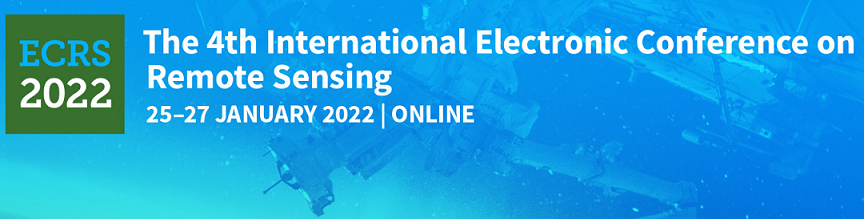
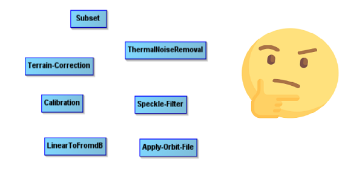

To my great pleasure I have been granted the [ECRS 2022 Best Presentation
Award of the 4th International Electronic Conference on Remote Sensing](https://ecrs-4.sciforum.net/#custom2325) for the session on SAR Data Processing. This simple fact might not be of great interest to anyone else so in order to help you decide whether to follow reading or not, these are the topics that are discussed in this post

1. The content of my presentation: I provide some tips for people interested in using Synthetic Aperture Radar imagery to estimate the extent of flooded areas. You do not have to be an expert on electromagnetic theory or digital image processing.
2. The delivery: my tips on how to prepare and deliver a successful presentation.

### The content
I have been working on Synthetic Aperture Radar (SAR) imagery from the Copernicus Sentinel-1 satellite for some time and I have found that the gap between the theory that can be learnt from textbooks and the practical knowledge needed to use the data in its many applications is very large. The people interested in using the free SAR data provided by the European Space Agency (ESA) through its Copernicus programme are not anymore only electronic engineers or physicists with a solid understanding of electromagnetic theory. Synthetic Aperture Radar is a very powerful technology that allows the monitoring of many natural and human-made phenomena such as floods, oil spills, subsidence, urbanization, volcanic eruptions, landslides, deforestation, glaciers and sea ice sheets melting. Given its broad range of applications SAR data users have a large variety of backgrounds: GIS analysts, natural resource managers, geologists, environmental  researchers, geographers, community managers, land use planners, farmers, economists just to mention a few categories. The SAR data products that can be downloaded from the [Copernicus Open Access Hub](https://scihub.copernicus.eu/dhus/#/home) have to undergo a quite complex digital image processing chain depending on the application.

In some applications such as for volcanic eruptions, landslides and subsidence the user needs the phase and the amplitude of the backscattered signal in order to detect a change that might have occurred over the Earth surface. The technique, called SAR interferometry, consists of counting the number of wavelengths of the radar backscatter signal along the path from the target to the antenna on board the satellite, before and after the event that caused the change. The difference in the number of wavelengths is a measure of the change occurred at the target area. In other applications such as for agriculture, forest mapping, urban areas monitoring and oil spills detection the user might need to estimate the change of the polarization of the backscattered radar signal. As I was working with the ESA [Science Toolbox Exploitation Platform](https://step.esa.int/main) to process the Sentinel-1 imagery in the middle of July 2021, Germany was hit by a devastating flood that killed 184 people and caused damages estimated to be €40 billions. I was living in Bonn at that time, very close to the affected areas so I decided to use the imagery and the toolbox to assess the extent of flooded area. The tutorials available on the tool's website were mostly addressed to people already skilled in remote sensing and digital image processing with detailed descriptions about the mathematical operators required to extract the flooded areas from the rest of the image but without a clear explanation of why those operators were required and in which order. I wrote some notes for myself putting together the sequence of operators required for the task at hand, among those available in the toolbox, with a short explanation of their function. After a couple of weeks I thought the notes might be useful to other people as well, not expert in SAR digital image processing, and I sent them to the [STEP Forum](https://forum.step.esa.int/). The notes were quite well received and added to the list of the [Sentinel-1 Toolbox tutorials](https://step.esa.int/main/doc/tutorials/). I shared the link to the tutorial on a LinkedIn group interested in Earth Observation that was well appreciated and I decided to participate in the 4th International Electronic Conference on Remote Sensing with my tutorial. The content was ready but what about presenting it ?   

### The delivery
I have given many presentations in my work but I never had the feeling to be good at that. Finally I came to the conclusion that presenting is something to be learnt, not something we are naturally gifted. So I looked for some textbooks and online courses and finally I found the course I was looking for, that could help me to improve my slides and my speech: the Matt Garrity's course [Dynamic Public Speaking](https://www.coursera.org/specializations/public-speaking), freely available on the Coursera platform. It's made up of four courses, not just one: an introductory part on rhetoric and the origin of public speaking, a course on how to organize and structure your presentation and slides, one about persuasive argumentation , and one last course on how to make an inspirational speech. In a few sentences what I learnt from the course:

* Make it clear what is the message you want to deliver to your public.
* Structure your speech. Provide an introduction, state the problem you are going to   talk about and say what you have done to solve it. Provide a conclusion.
* Do not add too much text to your slides, better no words at all than too many. Remember the adage "a picture is worth one thousand words".
* Do not read, never. Prepare the delivery of your presentation with someone else kind enough to listen to you or in front of a mirror.

### Conclusion
SAR is a powerful technology with many applications and an increasing number of users with different backgrounds eager to use the data and the tools made available by the Copernicus programme. Each application exploits different properties of the electromagnetic radiation and of its interaction with the Earth's surface that might be difficult to grasp without a long training on electromagnetic theory and digital image processing. The learning curve can be made much less steep by developing tutorials that contain the practical information on how to use a tool with the contextual information about the theory relevant to the specific application.  

My slides for the presentation are available [here](../assets/copernicus/ECRS2022_Wed_Selmi_055614.pdf). You can look for my tutorial on the ESA STEP website, section [Sentinel-1 Toolbox](http://step.esa.int/main/doc/tutorials/) (SAR Applications): Flood mapping using the Sentinel-1 imagery and the ESA SNAP S1-Toolbox, October 2021, or [download it](../assets/sentinel-1/flood_mapping_using_sentinel-1_imagery_v1.pdf) directly from my website A new version of the tutorial will be available soon. 
