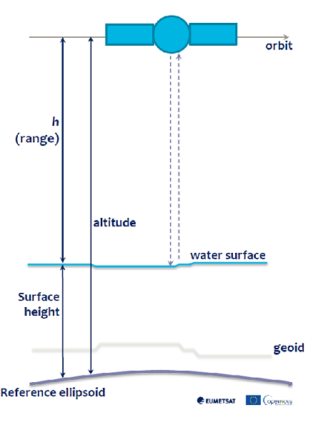

This post contains my notes from the webinar “[Recent Development in S6 Altimetry Measurement](https://training.eumetsat.int/course/view.php?id=445)” organized by EUMETSAT the 29th September 2022 with Ben Loveday, Vinca Rosmorduc, Christine Traeger Chatterjee and Hayley Evers-King. The webinar took place on Zoom. Q&A on [Slido](https://www.slido.com/) (code #EUMSC33). The training provided by EUMETSAT is fundamental to those who want to use the data that is made available by the ESA under an open data policy.

## Sentinel-6 Radar Altimetry
[Sentinel-6](https://www.eumetsat.int/sentinel-6) is a satellite dedicated to the measurement of the sea level and significant wave height. The first satellite was launched in November 2020, a second satellite is expected to be launched in 2025. The Sentinel-6 altimeter is an improved version of the SRAL altimeter on board the Sentinel-3 satellites. The technique used for the observations is radar altimetry. The technique can  also be used to monitor the level of natural and artificial water bodies (i.e. lakes and dams), snow and ice sheets. The webinar focused on the marine domain. The main payload of Sentinel-6 is a Poseidon-4 synthetic aperture radar looking at nadir that works on two bands: Ku band (13.575 GHz, or 2.2 cm wavelength) and C band (5.41 GHz, or 5.5 cm wavelength). A very simplified idea of the technique can be gained from what follows. The radar on board of the satellite sends electromagnetic pulses that after a certain amount of time reach the sea surface from which are reflected backwards, and after an equal amount of time hit the radar antenna.  The distance, or range, of the satellite from the sea surface can be computed knowing the speed of light

$$ range = \frac{c * \tau }{2} $$

where $\tau$ is the travel time of the pulse from the radar to the sea surface and back, and $c$ is the speed of light. Once we have the range between the satellite and the sea surface, we can compute the height of the sea surface from the reference ellipsoid, the mathematical model that represents the shape of the Earth, from the difference between the altitude of the satellite, that is its distance from the same reference ellipsoid, and the range

$$sea\text{ }surface\text{ }height = altitude - range$$

|  |
|:--:|
|*Sea-surface height measurement, (Credits: Vinca Rosmorduc, CLS)*|

The satellite also hosts a GNSS system for precise orbit and altitude determination, and a microwave radiometer used to determine the error on the measure of the path of the radar signal due to the water vapor in troposphere. The (goal) resolution in height measurement is 0.5 cm, the resolution achieved so far is 0.62 cm. The along-track resolution is 50 cm. The along-track resolution is relevant for coastal sea level measurements, less relevant in the open sea. The sea level rise that has been observed so far is **3.53 mm/year**, that is more than 1 cm every three years, an alarming value that tells us a lot about the relevancy of these observations.

## Data Products and Service with Python Client and Examples
The Sentinel-6 products are released through the [EUMETSAT Data Service](https://data.eumetsat.int/). By searching for “Altimetry” on the user interface the Sentinel-6 products can be found and downloaded. A web service is also available for programmatic access to the data. Examples on how to access the service using the EUMDAC Python client are given on the [EUMETlab](https://gitlab.eumetsat.int/eumetlab) platform with examples on how to use the Sentinel-6 products. The documentation is available on [EUMETSAT JIRA](https://eumetsatspace.atlassian.net/wiki/spaces/EUMDAC/overview) platform

## Q&A Session
Questions have been written on slido.com and the answers are available in the video recording of the webinar.

## Resources
A good resource to learn about radar altimetry, in addition to the [slides](https://training.eumetsat.int/pluginfile.php/45283/course/section/4540/Vinca%20Rosmorducs%20presentation.pdf) by Vinca Rosmorduc presented in the webinar, is the book by Iain H. Woodhouse, [Introduction to Microwave Remote Sensing](https://www.amazon.com/Introduction-Microwave-Remote-Sensing-Woodhouse-ebook/dp/B00U4D8EJM), that dedicates 16 pages to radar altimeters. Other resources are available on the [altimetry.info](http://www.altimetry.info/) website with a [tutorial](http://www.altimetry.info/filestorage/Radar_Altimetry_Tutorial.pdf) about the applications of radar altimetry.
