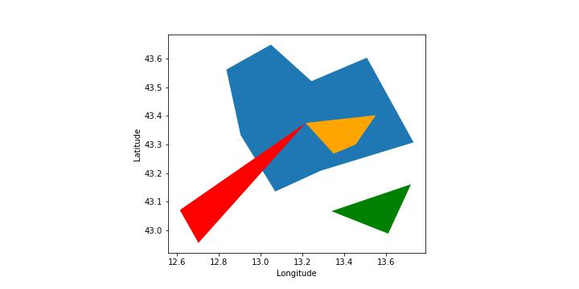
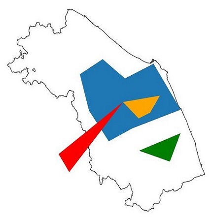
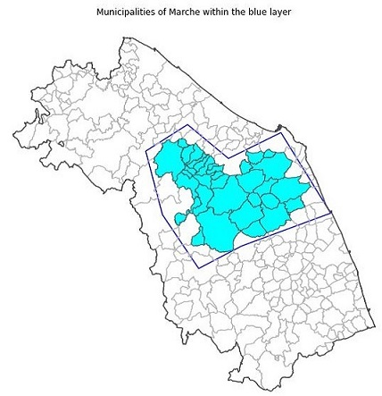
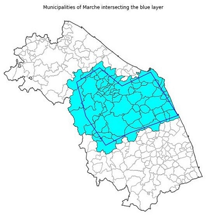
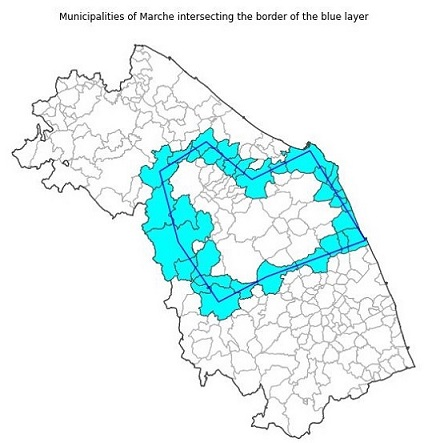

Humans have the ability to figure out the spatial relations of objects in their visual field without any effort. It is certainly an evolutionary characteristic that has been embedded in our brain because of its importance in many common reasoning tasks. Since objects can be represented in computer systems, algorithms have been developed over the years to support the same functions.

 In many applications of geoscience, for example in emergency management or risk assessment, one wants to know the spatial context of the area in which a certain event occurred and link the spatial information to external data sources through a named entity. For example, it is not enough to know the extent of a flooded area, we want to know in which administrative region it lies, or we might want to know the distance of a wildfire from a real estate or a populated area. In other words, we want to know the spatial relation between the area in which an event occurred and the area that belongs to or is run by a owner or authority. This post describes the notebook that I have developed on the implementation of spatial relations in GeoPandas. The reader can go directly to the [Jupyter notebook](https://github.com/luigiselmi/geoscience/blob/main/topological_operators.ipynb) in case she or he wants to see the code. We will deal only with topological relations, a subclass of spatial relations that don't need a metric, that is a way to compute the distance between two spatial objects. The notebook starts by creating some simple spatial objects, points and polygons, to see what kind of topological relations can be established between them. Finally, the topological relations will be tested between our abstract layers, blue, red, orange and green, and the geometry of Marche, one of the 20 regions of Italy, and of its administrative units, i.e. the municipalities.

## Python packages
Spatial objects such as points, lines and polygons, may have one or more topological relationships such as *contains*, *overlap*, *within*, *touches*. The Python package [Shapely](https://github.com/shapely/shapely), included in GeoPandas, implements such functions for points, lines and polygons. Shapely is a Python port of [GEOS](https://libgeos.org/), the C++ port of the [Java Topology Suite (JTS)](https://github.com/locationtech/jts/), a Java implementation of topological relations. We start by importing the Python packages we are going to use. We use the minimum set of packages to get the job done.

## Coordinate reference systems
Even if establishing the topological relationship between two spatial objects doesn't involve a metric, objects must be represented using the same coordinate reference system (CRS). We will create some spatial objects using the unprojected reference system WGS84 [EPSG:4326](https://epsg.io/4326). We will also import two datasets: the border of the Marche region and the borders of its administrative units, the municipalities of the region. We will see what spatial relations exists between our abstract layers and the Marche region and its administrative units. The two datasets have their own CRS whose ESPG code is [EPSG:32632](https://epsg.io/32632). This CRS is projected on a 2D surface using the Transverse Mercator projection and the unit of measure is the meter so, in order to use the spatial relationships between the spatial objects of our layers and the polygons of the Marche region and its administrative units we will have to change the CRS of our layers to be the same as that used for the region and its municipalities and transform the coordinates of points and polygons accordingly.

## Spatial joins
Spatial relations are used to merge two spatial datasets A and B in which each row of A and B contains spatial objects. The merge can be based on one topological relation such as "contains", so that if object *i* of A contains object *i* of B, the value in one or more columns of B will be added to the object in A. We will not deal with spatial joins here since it's an application of the topological relations.

## Spatial objects, areas of interest, and layers
We will use spatial objects such as Points, Lines and Polygons for which a set of coordinate pairs will be assigned. A layer is a collection of one or more spatial objects that describes a certain event that occurred over an area of interest. In GeoPandas a layer is built using a GeoDataFrame. A GeoDataFrame is a subclass of the DataFrame class of the Pandas Python library that has a column with geometry.

## Topological relations
We apply the topological relations: *within*, *intersects* and *touch* between the polygons that we have defined. We will not use *contains* since it's the inverse of *within*. We will apply the topological relations to pairs of polygons from two different layers. The methods take the left operand from a polygon of one layer and the right operand from the corresponding polygon of the other layer. By "corresponding" we mean the polygons have the same index value in the two GeoDataFrame used to implement our layers. Since so far we have only one polygon in each layer their index value is 0.

### within
From the [relation definition](https://geopandas.org/en/stable/docs/reference/api/geopandas.GeoSeries.within.html) in Geopandas: "An object is said to be within another if at least one of its points is located in the interior and no points are located in the exterior of the other."

### intersects
From the [relation definition](https://geopandas.org/en/stable/docs/reference/api/geopandas.GeoSeries.intersects.html) in GeoPandas: "An object is said to intersect another if its boundary and interior intersects in any way with those of the other."

### touches
From the [relation definition](https://geopandas.org/en/stable/docs/reference/api/geopandas.GeoSeries.touches.html): "An object is said to touch another if it has at least one point in common with other and its interior does not intersect with any part of the other. Overlapping features therefore do not touch."

## Projections
When we want to apply the topological relations to spatial objects from different layers (GeoDataFrame) we have to check that the coordinate reference system (CRS) used in the two layers is the same. In the following sections we will use two datasets that use the Transverse Mercator projection (EPSG:32632). Since our colored layers use the WGS84 unprojected CRS (EPSG:4362) we will have to change it and use the EPSG:32632. When we change the CRS GeoPandas transforms the coordinates of the points automatically. The coordinate units in the Transverse Mercator projection is in meters instead of degrees.

## Spatial relations in the real world
Our points and polygons in the blue, red, orange and green layers are not completely abstract. They represent towns and areas in the Marche region. We want to find out which spatial relationships between them, the Marche region and its administrative units, the municipalities, hold true and which do not.

## Municipalities of the Marche region
We want to see which municipality lies within the polygon of the blue layer. We start by opening the dataset of the municipalities of the Marche region. This dataset has been extracted from the dataset of the Italian municipalities from ISTAT, the Italian National Institute of Statistics (see ref.2) and it is available in the data folder of the repository.

|| |
|:--:|:--:|
|*Municipalities of Marche within the blue layer*|*Municipalities of Marche intersecting the blue layer*|

## Further logic operations with masks
Again, we want to add the information about the spatial relationship *intersects* between a municipality and the blue area to the municipalities layer. As we can see the *within* relationship is stronger than *intersects* so we will keep it and we will represent the *intersects* relationship with a 'Intersects' value only for those municipalities that intercepts the blue area but are not completely within it.

## Conclusion
We have seen some examples of spatial relations between polygons in GeoPandas. We have applied such relations to geometries of the municipalities of the Marche region in Italy. We have changed the coordinate reference system of our example layers to be the same as that used for the Marche region and its administrative units. We have also performed a further logical operation dividing the geometries of the municipalities that strictly intersect one of our fictional layer from those that lie completely in our layer using logical operators on the result of the spatial relations. Spatial relations are fundamental to perform spatial analysis over multiple layers. We want to underline that they also provide a mean to integrate the information about events, such as flooded areas, with contextual information from external data sources by using the name or identifier of a named entity whose geometry has a spatial relation with the event. As said in the introduction the Jupyter notebook with the Python code used for this post is available on my [GitHub repository](https://github.com/luigiselmi/geoscience/blob/main/topological_operators.ipynb).      

## References
1. [Wikipedia - Spatial relation](https://en.wikipedia.org/wiki/Spatial_relation)
2. [ISTAT - Administrative Boundaries (updated to January 1st 2022](https://www.istat.it/it/archivio/222527)
