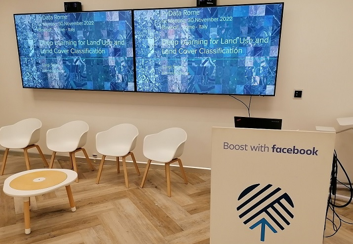

||
|:--:|
|*The meeting room at Binario F*|

So we managed to have our 1st PyData Rome meeting. We started the Rome chapter of the [PyData community](https://pydata.org/) in September. [The group on Meetup](https://www.meetup.com/pydata-rome/) counts 31 members right now. There were 12 members that subscribed to participate and 3 of them eventually found their way to the meeting room hosted at [Binario F](https://binariof.fb.com/en/), an initiative by Facebook to provide a physical space for business and individual development in Rome. You may say that was a failure, as only three people came to the meeting. No, I say it was a success: 25% of those who subscribed came, and two others wrote to me thinking it was online (sorry guys!).

## Numbers are not the most important metric for a meeting
First of all, I had fun in preparing the presentation and meeting with other like-minded people. We had an interesting talk before the beginning of the presentation, during its delivery and after it. Beyond the technical discussion about Deep Learning and satellite imagery we had a very interesting conversation about the lack of opportunities for developers interested in data science to meet and share ideas outside of an academic environment in Rome. That is exactly what we want to address with the PyData Rome chapter. Rome is not San Francisco but there are three universities with data science departments full of smart people and one of this, the [Sapienza University of Rome](https://en.wikipedia.org/wiki/Sapienza_University_of_Rome) is one of the largest European universities. So it's not the lack of people, it's the culture, the idea hidden in our mind that participating in these events after you leave your academic institution and start to work doesn't really matter anymore.

## Participation matters
We are here to say it does matter. It matters because we have to be lifelong learners if we want to make contributions to society and keep control of our working life. One other important aspect is that science is too much a relevant enterprise to be left exclusively to academic institutions. There must be a collaboration between academic institutions and people, citizens, and private organizations that are interested in science, not a wall or a border that cannot be crossed. There are several critical problems to be addressed for which our societies need people able to invent and apply algorithms to make sense of the data coming from satellites and other sensors. This is the mission of the PyData community and the reason for which we joined.

## Learning is fun
Last but not least, learning is fun and using what we learn for things that matter with other people is even more fun. In conclusion, I want to thank the participants, Binario F, the people who helped to set up the room for the presentation, and in particular [Matteo Franza](https://www.utopialab.it/utopia-team/matteo-franza/) who manages the space and provided us an excellent room for our meeting.

(The slides used for the presentation with links to code and other materials are available [here](../assets/pydata_rome/Deep_Learning_for_LULC_Classification_PyData_Rome_Meeting_30_Nov.2022.pdf))           
