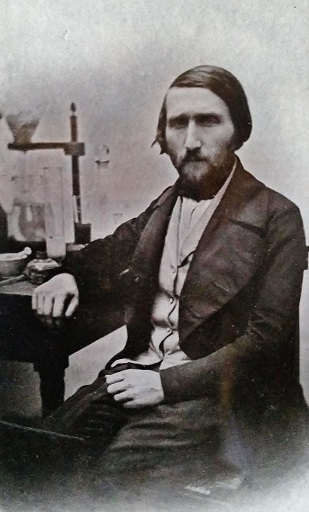

||
|:--:|
|*The Italian chemist Francesco Selmi in his laboratory, a XIX century scientific worker*|

Today May 1st, the international workers’ day, is the perfect day to reflect on the role of the worker, that is, of the one who lives from his or her work, operating on the environment and on society, more and more often through a computer. My thesis is that to survive and thrive in the current and future world, under the impacts of climate change, and the technological disruptions brought by artificial intelligence and quantum computers, the worker must transform herself into a scientific worker. The main activity of this new kind of worker is to learn, in order to act in a conscious, rational and effective manner, in harmony with the society and the environment. In the followings, after a short premise, I have reported a list of topics that I consider fundamental to master for the scientific worker (naturally among these there is also English). I have put the adjective “scientific” in parentheses in the title because every worker will have to be a scientist, and continuously learn, so that there should be no need to use the adjective.

## The new worker
The modern worker must be able to read and interpret the data coming from the environment: physical, social, economical and financial environment. The data must be available in digital format, open and easily usable by computing machines. The worker must be able to read, transform, interpret, and produce data. In order to possess these skills the worker must have a good and actionable knowledge of  mathematics, physics, biology, finance, and computer science. Here follows a list of topics that, according to my experience, a scientific worker should grasp.

### Maths
* Real and complex analysis
* Probability distributions
* Differential equations
* Graph theory
* Neural networks
* Optimization and linear programming
* Data assimilation, inversion and interpolation

### Physics
* Mechanics (Newtonian, Lagrangian, Hamiltonian)
* Electromagnetism and matter-radiation interaction
* Quantum Mechanics
* Statistical Physics

### Biology
* Anatomy and physiology
* Genetics

### Computer science
* Computer architecture
* Computer programming
* Algorithms and data structures
* Computational complexity
* Parallel computing
* Cryptography
* Digital Signal Processing

### Finance
* Fixed income securities
* Random cash flows
* Portfolio selection

This knowledge is fundamental, independently of the economy in which the (scientific) worker operates, that is, market or socialist economy.

## Education and culture
Open and machine readable data is not enough. The cost of education should be kept at its minimum and I appreciate those who publish their scientific work freely online. I publish a collection of high quality books made freely available by their authors [here](/bookshelf) on my website.  One more important characteristic of the (scientific) worker is a knowledge sharing culture. For this reason I have organized the PyData Rome group on Meetup.

## Conclusion
If you see yourself as a (scientific) worker you are invited to join the [PyData Rome](https://www.meetup.com/pydata-rome/) group today. **Happy international workers’ day!**
