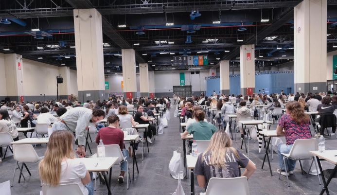

## Il numero chiuso
L'iscrizione al corso di laurea in medicina nelle universita' italiane e' a numero chiuso dal 1987, confermato con decreto ministeriale nel 1999. Fino al 2024 per l'ammissione occorreva superare un test unico ([TOLC](https://www.cisiaonline.it/)) di matematica, fisica, chimica e biologia. Superato il test, con un punteggio sufficiente per rientrare nel numero dei posti disponibili, si era ammessi a seguire i corsi.

## Il semestre aperto
Dal 2025 il test e' stato sostituito con il [semestre aperto](https://www.universitaly.it/medicina2025) che prevede la libera ammissione ai corsi di fisica, chimica, e biologia del primo semestre con due appelli per gli esami, il 20 novembre e il 10 dicembre. Per essere ammessi ai corsi del secondo semestre occorre aver superato tutti e tre gli esami, con un punteggio minimo di 18/30, e rientrare nella graduatoria per i posti disponibili. Chi supera gli esami ma non rientra nella graduatoria conserva i crediti formativi e puo' scegliere di passare ad un'altra facolta senza numero chiuso.

## Il flop degli esami
I risultati del primo appello non sono stati incoraggianti. Solo circa il 20% degli studenti è riuscito a superare gli esami di chimica e biologia mentre per fisica si può parlare di un vero e proprio flop con solo il 12% degli studenti che hanno superato l'esame. Volendo esaminare le possibili cause di questi risultati, in particolare per la fisica, possiamo subito considerare il poco tempo a disposizione per lo studio. I corsi sono iniziati a settembre quindi per il primo appello gli studenti hanno avuto meno di tre mesi per la preparazione. Un altro dettaglio utile è il tempo a disposizione per rispondere alle [domande dell'esame](https://iscrizioni-semestre-aperto.mur.gov.it/files/esami_1/fisica.pdf): **45 minuti per 31 domande**.

## L'insegnamento di fisica
Secondo il [syllabus del Ministero dell'Università e della Ricerca (MUR)](https://www.mur.gov.it/sites/default/files/2025-06/Decreto%20Ministeriale%20n.%20418%20Syllabus_fisica%20errata%20corrige%2024.06.2025.pdf), l'insegnamento di fisica per il corso di medicina comprende sette unità didattiche, dalla meccanica, all'elettromagnetismo. E' importante sottolineare che **il MUR assume conoscenze da parte degli studenti di matematica, fisica, chimica e biologia, a livello degli insegnamenti impartiti nei licei e negli istituti tecnici e professionali**. Le domande dell'esame sono in effetti a livello della fisica che si studia alle superiori quindi gli studenti si possono preparare utilizzando gli stessi testi o anche online per esempio consultando su Wikipedia le voci riportate nel sillabo. Di seguito sono riportate sommariamente le materie per ciascuna unità didattica.

### 1. Introduzione ai metodi della fisica
* [Grandezze fisiche](https://it.wikipedia.org/wiki/Grandezza_fisica), dimensione ed unità di misura, [Sistema Internazionale delle unità di misura](https://it.wikipedia.org/wiki/Sistema_internazionale_di_unit%C3%A0_di_misura).
* Conversioni tra unità di misura e stima dell'ordine di grandezza. Grandezze estensive ed intensive.
* Grandezze scalari e [vettoriali](https://it.wikipedia.org/wiki/Grandezza_vettoriale)

### 2. Meccanica
* [Cinematica](https://it.wikipedia.org/wiki/Cinematica) del punto materiale  
* [Dinamica](https://it.wikipedia.org/wiki/Dinamica) del punto materiale, [forza gravitazionale](https://it.wikipedia.org/wiki/Legge_di_gravitazione_universale), [forza elastica](https://it.wikipedia.org/wiki/Forza_elastica), legge di Hooke per molle ideali, forze di contatto e [forza di attrito](https://it.wikipedia.org/wiki/Attrito)   
* [Lavoro](https://it.wikipedia.org/wiki/Lavoro_(fisica)) ed [energia](https://it.wikipedia.org/wiki/Energia), principio di conservazione dell'energia  
* [Quantità di moto](https://it.wikipedia.org/wiki/Quantit%C3%A0_di_moto) e [impulso](https://it.wikipedia.org/wiki/Impulso_(fisica)), [principio di conservazione della quantità di moto](https://it.wikipedia.org/wiki/Legge_di_conservazione_della_quantit%C3%A0_di_moto) e del momento
* Sistemi di punti materiali, [corpi rigidi](https://it.wikipedia.org/wiki/Corpo_rigido) e [elastici](https://it.wikipedia.org/wiki/Elasticit%C3%A0)

### 3. Meccanica dei fluidi
* [Idrostatica](https://it.wikipedia.org/wiki/Fluidostatica): principio di Archimede, principio di Pascal, legge di Stevino
* [Idrodinamica](https://it.wikipedia.org/wiki/Fluidodinamica): equazione di continuità e conservazione della massa, [teorema di Bernoulli](https://it.wikipedia.org/wiki/Equazione_di_Bernoulli), [teorema di Torricelli](https://it.wikipedia.org/wiki/Legge_di_Torricelli)
* [Fluidi reali](https://it.wikipedia.org/wiki/Fluido) e [viscosità](https://it.wikipedia.org/wiki/Viscosit%C3%A0): legge di Poiseuille
* Fenomeni di superficie: [tensione superficiale](https://it.wikipedia.org/wiki/Tensione_superficiale), [capillarità](https://it.wikipedia.org/wiki/Capillarit%C3%A0)

### 4. Onde Meccaniche (Acustica)
* [Oscillatore armonico](https://it.wikipedia.org/wiki/Moto_armonico), propagazione delle [onde acustiche](https://it.wikipedia.org/wiki/Onda_sonora), onde trasversali e longitudinali
* [Principio di sovrapposizione](https://it.wikipedia.org/wiki/Principio_di_sovrapposizione) e [interferenza](https://it.wikipedia.org/wiki/Interferenza_(fisica))
* Energia trasportata dalle onde
* Onde acustiche: propagazione del suono nei diversi mezzi materiali e percezione sonora
* [Effetto Doppler](https://it.wikipedia.org/wiki/Effetto_Doppler)

### 5. Termodinamica
* [Variabili di stato](https://it.wikipedia.org/wiki/Termodinamica), [gas ideale](https://it.wikipedia.org/wiki/Gas_ideale), [teoria cinetica dei gas](https://it.wikipedia.org/wiki/Teoria_cinetica_dei_gas)
* [Calore](https://it.wikipedia.org/wiki/Calore), [calore specifico](https://it.wikipedia.org/wiki/Calore_specifico) e [capacità termica](https://it.wikipedia.org/wiki/Capacit%C3%A0_termica), [cambiamenti di stato](https://it.wikipedia.org/wiki/Transizione_di_fase)
* Meccanismi di trasmissione del calore: [conduzione termica](https://it.wikipedia.org/wiki/Conduzione_termica), [convezione](https://it.wikipedia.org/wiki/Convezione) e [irraggiamento](https://it.wikipedia.org/wiki/Irraggiamento), [legge di Wien](https://it.wikipedia.org/wiki/Legge_di_Wien)
* [Primo principio della termodinamica](https://it.wikipedia.org/wiki/Primo_principio_della_termodinamica), [trasformazioni termodinamiche](https://it.wikipedia.org/wiki/Trasformazione_termodinamica) reversibili e irreversibili
* [Secondo principio della termodinamica](https://it.wikipedia.org/wiki/Secondo_principio_della_termodinamica), [entropia](https://it.wikipedia.org/wiki/Entropia), [ciclo di Carnot](https://it.wikipedia.org/wiki/Ciclo_di_Carnot)

### 6. Elettricità e magnetismo
* [Cariche elettriche](https://it.wikipedia.org/wiki/Carica_elettrica), legge di Coulomb, moto di una carica in un campo elettrico uniforme
* [Legge di Gauss](https://it.wikipedia.org/wiki/Teorema_del_flusso#Campo_elettrico)
* Energia e [potenziale elettrico](https://it.wikipedia.org/wiki/Potenziale_elettrico), [dipolo elettrico](https://it.wikipedia.org/wiki/Dipolo_elettrico) e momento di dipolo
* [Corrente elettrica](https://it.wikipedia.org/wiki/Corrente_elettrica), [legge di Ohm](https://it.wikipedia.org/wiki/Legge_di_Ohm), [resistenza elettrica](https://it.wikipedia.org/wiki/Resistenza_elettrica)  
* [Condensatori](https://it.wikipedia.org/wiki/Condensatore_(elettrotecnica)) in serie e in parallelo
* [Campo magnetico](https://it.wikipedia.org/wiki/Campo_magnetico), [forza di Lorentz](https://it.wikipedia.org/wiki/Forza_di_Lorentz), moto di una carica elettrica in un campo magnetico uniforme
* [Induzione elettromagnetica](https://it.wikipedia.org/wiki/Induzione_elettromagnetica), [legge di Faraday](https://it.wikipedia.org/wiki/Legge_di_Faraday)

### 7. Radiazioni elettromagnetiche
* [Onde elettromagnetiche](https://it.wikipedia.org/wiki/Radiazione_elettromagnetica), lunghezza d’onda, frequenza, velocità di propagazione, energia
* [Spettro della radiazione elettromagnetica](https://it.wikipedia.org/wiki/Spettro_elettromagnetico)  
* [Quantizzazione dell’energia](https://it.wikipedia.org/wiki/Quantizzazione_del_campo_elettromagnetico)
* [Radioattività](https://it.wikipedia.org/wiki/Radioattivit%C3%A0) e decadimento radioattivo
* [Radiazioni ionizzanti](https://it.wikipedia.org/wiki/Radiazioni_ionizzanti) e non ionizzanti
* [Ottica](https://it.wikipedia.org/wiki/Ottica_geometrica), leggi della riflessione e della rifrazione della luce, [lenti](https://it.wikipedia.org/wiki/Lente) convergenti e divergenti

## Le domande dell'esame di fisica
Veniamo ora alle [domande dell'esame di fisica](https://iscrizioni-semestre-aperto.mur.gov.it/files/esami_1/fisica.pdf) del primo appello pubblicate sul sito del MUR per verificare come sono distribuite tra le sette unità didattiche e quali difficoltà matematiche possono presentare. Come detto, sono 31 domande, 15 a risposta multipla e 16 a completamento. Il tempo a disposizione è 45 minuti. Il punteggio è attribuito come segue:

- 1 punto per ogni risposta esatta;
- 0 punti per ogni risposta omessa;
- meno 0,10 (- 0,10) punti per ogni risposta errata.

La risposta corretta è una sola.   

Sia le domande a risposta multipla che quelle a completamento possono richiedere come risposta una parola o un numero. Nel primo caso è sufficiente ricordare quanto appreso per completare il testo della domanda con la parola corretta. Nel secondo caso occorre anche svolgere semplici calcoli aritmetici o algebrici al livello delle scuole superiori per ottenere la risposta corretta.

### Distribuzione delle domande per unità didattiche
Vediamo il numero di domande per ciascuna unità didattica, senza distinzione tra domande a risposta multipla o a completamento

1. Introduzione ai metodi della fisica: 4
2. Meccanica: 6
3. Meccanica dei fluidi: 5
4. Onde meccaniche: 3
5. Termodinamica: 3
6. Elettricità e magnetismo: 6
7. Radiazioni elettromagnetiche: 4

Non c'è stata quindi una grande differenza tra le unità didattiche a parte per meccanica e elettromagnetismo a cui corrispondono anche il maggiore numero di crediti formativi (cfu), rispettivamente 1.5 e 1.25.

## Conclusione
Contrariamente a quanto riportato da molti, non è certamente la matematica la causa del flop nell'esame di fisica dato che, come detto sopra, si è trattato sempre di semplici calcoli algebrici e aritmetici. La causa è certamente nel poco tempo a disposizione per assimilare tutta la fisica classica, dalla meccanica all'elettromagnetismo, passando per la termodinamica e la meccanica dei fluidi, particolarmente rilevanti per chi si appresta alla carriera medica. Chi non è arrivato già all'inizio dei corsi a settembre con solide basi in tutte le unità didattiche previste dal sillabo ha avuto scarse probabilità di farcela. Quindi da una parte gli studenti devono anticipare la preparazione senza attendere l'inizio dei corsi dato che il livello di conoscenze fisiche e matematiche non è superiore a quello acquisito negli istituti superiori. Per rispondere velocemente alle domande occorre anche, da parte degli studenti, molta pratica, non solo la teoria. D'altra parte 45 minuti per rispondere a tutte le domande sembrano onestamente pochi. A volte una piccola modifica alle procedure, come dare più tempo a disposizione per lo svolgimento dell'esame, può risolvere il problema senza dover inventare di nuovo la ruota.    
