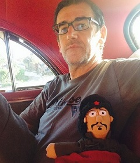

I work as a scientific software engineer at my own company [datiaperti](https://www.datiaperti.it) based in Rome, Italy. Before taking the leap from being an employee to being self-employed, I worked as a software engineer in many public and private organizations in Italy, Switzerland and Germany. In Germany I worked at the [Fraunhofer Institute for Intelligent Analysis and Information Systems](https://www.iais.fraunhofer.de/en.html) in EU and German funded research projects and industry projects related to Semantic Web, Machine Learning and Big Data technologies. In Switzerland, I worked as a research associate and software engineer in two FP7 research projects about data integration using Semantic Web technologies at the E-Government Institute of the [Bern University of Applied Sciences](https://www.bfh.ch/en/). Before moving abroad I worked in Italy as a consultant in software development projects at various multinational companies such as Ericsson, Marconi Communications, Accenture, and Italian government institutions. I hold an M.Sc. in Physics from the [Sapienza University of Rome](https://www.phys.uniroma1.it/fisica/en) with a thesis on Atmospheric Physics and Laser Radar Remote Sensing under the supervision of [Prof. Giorgio Fiocco](https://en.wikipedia.org/wiki/Giorgio_Fiocco). I have co-authored papers on Semantic Web, E-Government and Remote Sensing. My main interests are artificial intelligence, algorithms, computer vision, earth observation and remote sensing, open source software development and open data.

## Work experience
#### Fraunhofer IAIS (2015-12-01 – 2019-11-30), Sankt Augustin (Germany)
I worked as project leader and software architect in EU and German research projects and industry projects based on Big Data, Semantic Technology and Machine Learning. As a software architect I designed the architecture of the Smart, Green and Integrated Transport pilot for the Big Data Europe H2020 project using open source frameworks such as Apache Kafka, Apache Flink, and Elasticsearch. I also acquired experience in using Docker containers for deployment. I led an industry project for a Spanish customer to implement and deploy the back-end of their online e-commerce platform and additional services based on Apache Solr and Apache Cassandra and machine learning algorithms for recommendations and price prediction. As a project leader I applied agile methodologies in both research and industry projects for project planning and management, cost estimation, development and continuous integration using the full set of tools provided by Atlassian.

#### E-Government Institute of the Bern University of Applied Sciences (2012-09-01 - 2015-10-31), Bern (Switzerland)
I was involved in two European FP7 projects both led by the Bern University of Applied Sciences. In the first project, [Fusepool](https://github.com/fusepool), I developed Java OSGi components for the transformation of XML or tabular data into RDF and for the disambiguation and interlinking of entities. The second project [Fusepool P3](https://github.com/fusepoolP3) was aimed at providing components to implement workflows for Linked Data Platforms. I participated in the writing of the proposal and in the development of the software. Each platform components could communicate with others through a REST interface. My work was focused on interlinking, based on
the Silk framework and in the use of geographical data. I developed also a semantic web application to visualize geographical data from a Linked Data Platform and search points of interest in a map. In both projects I participated in the writing of deliverables and published papers as author or co-author in peer-reviewed journals.

#### University of Trento Dept. of Information Engineering and Computer Science (2011-03-01 - 2011-08-31)
I received a scholarship for a research study on data integration at the entity level through heterogeneous systems.

## Publications
* L. Selmi - Flood mapping using the Sentinel-1 imagery and the ESA SNAP S1 Toolbox, 2021, ESA SNAP Tutorials ([link](https://step.esa.int/main/doc/tutorials/))  
* Josep Maria Salanova Grau, Evangelos Mitsakis, Panagiotis Tzenos, Iraklis Stamos, Luigi Selmi, Georgia Aifadopoulou - Multisource Data Framework for Road Traffic State Estimation, Journal of Advanced Transportation, Hindawi ([link](https://doi.org/10.1155/2018/9078547))  
* Ivan Ermilov, Axel-Cyrille Ngonga Ngomo, Aad Versteden, Hajira Jabeen, Gezim Sejdiu, Giorgos Argyriou, Luigi Selmi, Jürgen Jakobitsch, Jens Lehmann - Managing Lifecycle of Big Data Applications, International Conference on Knowledge Engineering and the Semantic Web, Springer ([link](https://link.springer.com/chapter/10.1007/978-3-319-69548-8_18))  
* L. Selmi, A. Neuroni - Fusepool P3: A Linked Data Platform for Open Government Data, IOS Press ([link](https://ebooks.iospress.nl/volumearticle/40810))  
* M. Kaschesky, L. Selmi - Fusepool R5 linked data framework: concepts, methodologies, and tools for linked data, Proceedings of the 14th Annual International Conference on Digital Government Research ([link](https://doi.org/10.1145/2479724.2479748))  
* P. Castracane, L. Selmi, S. Casadio, M. Cacciani and G. Fiocco - Ground-based remote sensing of wind, temperature and aerosol backscattering in an urban environment during different atmospheric stability conditions, Ed. Physics and chemistry of the earth. Part B: Hydrology, oceans and atmosphere, Elsevier Science ([link](https://doi.org/10.1016/S1464-1909(00)00246-X))  

## Presentations and awards
* 30th November 2022 PyData Rome: Deep Learning for Land Use and Land Cover classification ([slides](assets/pydata_rome/Deep_Learning_for_LULC_Classification_PyData_Rome_Meeting_30_Nov.2022.pdf))
* 19-21 October 2022 - SISC2022: Governing the Future. 10th Annual SISC Conference, Rome, Italy ([Certificate of Attendance](assets/cv/SISC2022_Conference.pdf))
* 19th October 2022 - [3rd Prize](assets/cv/Wekeo_JNC_2022_Luigi_Selmi.pdf) of the Wekeo Jupyter Notebook Competition  
* 23-27 May 2022 - Living Planet Symposium 2022, Bonn (Germany) - Land Use and Land Cover Classification using CNN Deep Learning Architectures (Poster Session)
* 25-27 January 2022 - The 4th International Electronic Conference on Remote Sensing - Flood mapping using Sentinel-1 SAR imagery and the ESA SNAP S1 Toolbox (Best Presentation Award)  
* 2nd European Semantic Web Conference Summer School 2012 [Student Project 1st Prize](assets/semweb/2nd_ESWC_2012_1st_Prize.jpg)

## Courses and Certifications
* 2021-11-19 [ESRI - Imagery in Action](https://www.esri.com/training/TrainingRecord/Certificate/lgslm1/60acd9af30ba2f5a03182bc3/-60)  
* 2021-12-05 [ESRI - Spatial Data Science: The New Frontier in Analytics](https://www.esri.com/training/TrainingRecord/Certificate/lgslm1/60acd9af30ba2f5a03182bc3/-60)  
* 2021-09-14 - Echoes in Space - Introduction to Radar Remote Sensing, EO College  
* 16-20 November 2020 - 2nd Joint Training Course on Atmospheric Composition, EUMETSAT, ESA, ECMWF  
* 2020-08-10 [Algorithms, Part 1](https://github.com/luigiselmi/algorithms#part-i). First part of the course taught by Kevin Wayne and Robert Sedgewick and offered by Princeton University on Coursera. This part of the course covers elementary data structures, sorting, and searching algorithms in Java.
* 2020-05-27 [Statistical Learning](https://courses.edx.org/certificates/4216f260f2f54b9ab7e597f0cd80c7af) An introductory-level course in supervised learning, with a focus on regression and classification methods. The lectures cover all the material in An Introduction to Statistical Learning, with Applications in R by James, Witten, Hastie and Tibshirani.   
* 2020-03-09 [Algorithms, Part 2](https://github.com/luigiselmi/algorithms#part-ii). Second part of the course taught by Kevin Wayne and Robert Sedgewick and offered by Princeton University on Coursera. This part of the course focuses on graph and string-processing algorithms in Java.  
* 2019-10-15 [ESRI - Going Places with Spatial Analysis](https://www.esri.com/training/TrainingRecord/Certificate/lgslm1/5d6e3145b697b1d6f63204f8/-120)     
* 2019-07-12 [Cryptography I](https://coursera.org/share/5b4e60ff514e93039d0710df093df9c4). An online course about symmetric and public-key cryptography taught by Prof. Dan Boneh and offered by Stanford University on the Coursera platform. I achieved a grade of 100 %.  
* 2018-07-22 - [Deep Learning Specialization](https://coursera.org/share/7db159dbb0e19624ef9ee4cd32822b7f). An online specialization on Deep Learning offered by deeplearning.ai on the Coursera platform and taught by Prof. Andrew Ng. It is made up of five courses: 1) Neural Networks and Deep Learning, 2) Improving Deep Neural Networks: Hyperparameter tuning, Regularization and Optimization, 3) Structuring Machine Learning Projects, 4) Convolutional Neural Networks, 5) Sequence Models. I achieved a grade of 100 % in all the five courses.  
* 2017-02-18 Project Management ([Part 1](https://coursera.org/share/69466c1b4c2e9a87cc404648d13183d5), [Part 2](), [Part 3]()) An online course offered by University of California, Irvine, on the Coursera platform and taught by Margaret Meloni, MBA, PMP. The course provides a broad introduction to project planning, risk management, budgeting, and scheduling.
* 2016-10-30 [Machine Learning](https://coursera.org/share/3059f81a80485678de7c0f6f61c171db). An online course offered by Stanford University on the Coursera platform and taught by Prof. Andrew Ng. The course provides a broad introduction to machine learning, datamining, and statistical pattern recognition. Topics include: (i) Supervised learning (parametric/non-parametric algorithms, support vector machines, kernels, neural networks). (ii) Unsupervised learning (clustering, dimensionality reduction, recommender systems, deep learning). (iii) Best practices in machine learning (bias/variance theory; innovation process in machine learning and AI). I achieved a grade of 98.8 %.  
* 2016-07-15 2nd International ScaDS Summer School on Big Data 2016, Universität Leipzig ([Certificate of Attendance](assets/cv/infai_scad_bigdata_cert.png))
* 2014-12-22 [Introduction to Logic](assets/cv/coursera_logic_cert.jpg). An online course offered by Stanford University and taught by Prof. M. Genesereth. The course is a rigorous
introduction to Logic. It covers the encoding of information as logical sentences, logical reasoning, and an introduction to logic technology and its applications. Logics covered include Propositional Logic and Relational Logic. I completed the course with distinction.
* 2012-07-20 International Association for Ontology and its Applications (IAOA) - 1st Interdisciplinary IAOA Summer School [Certificate of Attendance](assets/semweb/IAOA_Summer_School_2012.jpg))
* 2012-07-14 9th Summer School on Ontological Engineering and the Semantic Web ([Certificate of Attendance](assets/semweb/SSSW_Ontological_Engineering_2012.jpg))
* 2012-05-26 2nd European Semantic Web Conference Summer School 2012 ([Certificate of Attendance](assets/semweb/2nd_ESWC_Summer_School_2012.jpg))
* 2010-05-14 Semsphere Semantic Technology Specialist Course - Vienna, Austria ([Certificate of Attendance](assets/cv/semsphere_cert.jpg))

## Languages
Italian is my mother tongue. I speak English fluently as it's the language I use the most since 2010. I can understand quite a bit of German, French and Portuguese. I got a [Cambridge First Certificate English](assets/cv/cambridge_esol_certificate.jpg) (Level B2 of the EU Reference for Languages) in 2010, and a [telc Zertifikat Deutsch B1](assets/cv/telc_Deutsch_B1.jpg) in 2017.

## Other skills
I like being in the nature, most often in the Apennine Mountains in Central Italy, not far from Rome. I have a 1° degree FIPSAS/CMAS [diver](https://www.flickr.com/photos/susterru/7939836234) license and I have been practicing [mountain climbing](https://www.flickr.com/photos/susterru/293369805) and [skiing](https://www.flickr.com/photos/susterru/2149914032).
