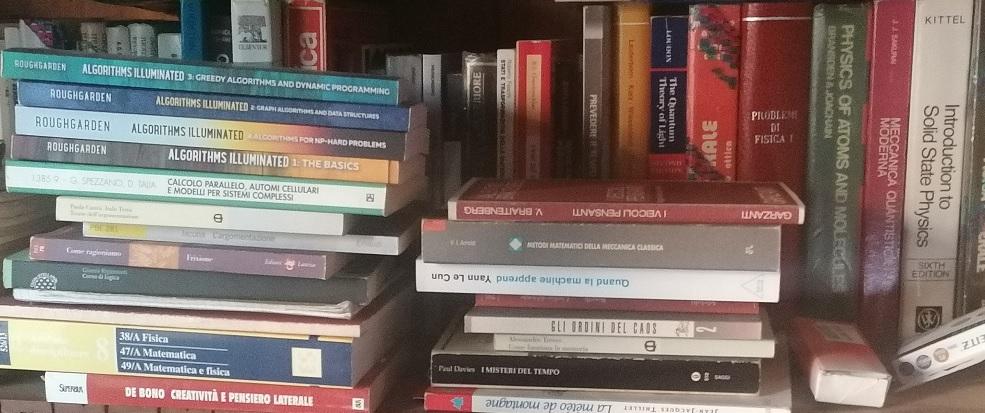

I am addicted to science and technology. Fortunately, there are many authors that kindly have made their textbooks available online for free.

Last update: October 21st, 2025.  

# Subject Index  

* [Physics](#physics)
    * [Classical Mechanics](#classical-mechanics)  
    * [Electromagnetism](#electromagnetism)
    * [Geophysics](#geophysics)  
        * [Atmospheric Physics, Meteorology, and Climate](#atmospheric-physics-meteorology-and-climate)    
        * [Inverse Theory](#inverse-theory)
        * [Oceanography](#oceanography)  
        * [Earth Observation and Remote Sensing](#earth-observation-and-remote-sensing)  
        * [Seismology](#seismology)  
    * [Mathematical and Computational Physics](#mathematical-and-computational-physics)  
    * [Quantum Mechanics and Computing](#quantum-mechanics-and-computing)  
    * [Statistical Mechanics](#statistical-mechanics)  
    * [Nuclear Physics](#nuclear-physics)  
    * [Medical Physics](#medical-physics)
* [Chemistry](#chemistry)
* [Geology](#geology)
* [Mathematics](#mathematics)  
    * [Foundations and Logic](#foundations-and-logic)  
    * [Algebra](#algebra)  
    * [Calculus](#calculus)  
    * [Numerical Methods](#numerical-methods)  
    * [Geometry](#geometry)
        * [Differential Geometry](#differential-geometry)
        * [Topology](#topology)  
        * [Computational Geometry](#computational-geometry)
    * [Probability and Statistics](#probability-and-statistics)  
        * [Stochastic Processes and Time Series](#stochastic-processes-and-time-series)
        * [Causal Inference](#causal-inference)  
    * [Number Theory](#number-theory)  
    * [Optimization and Linear Programming](#optimization-and-linear-programming)  
    * [Graph Theory](#graph-theory)  
    * [Game Theory](#game-theory)  
    * [Category Theory](#category-theory)  
* [Computer Science](#computer-science)  
    * [Algorithms and Data Structures](#algorithms-and-data-structures)  
    * [Distributed Systems and High Performance Computing](#distributed-systems-and-high-performance-computing)  
    * [Computer Programming](#computer-programming)  
        * [C/C++](#c-and-c++)  
        * [R](#r)  
        * [JavaScript](#javascript)  
        * [Haskell](#haskell)  
        * [Scala](#scala)  
        * [Java](#java)  
        * [Python](#python)  
        * [Rust](#rust)
    * [Data Science](#data-science)  
    * [Data Visualization](#data-visualization)  
    * [Machine Learning](#machine-learning)  
    * [Neural Networks, Deep Learning, and Reinforcement Learning](#neural-networks-deep-learning-and-reinforcement-learning)  
    * [Genetic Programming](#genetic-programming)  
    * [Digital Signal Processing and Information Theory](#digital-signal-processing-and-information-theory)  
    * [Computer Vision and Computer Graphics](#computer-vision-and-computer-graphics)  
    * [Information Retrieval](#information-retrieval)  
    * [Natural Language Processing](#natural-language-processing)  
    * [Artificial Intelligence and Robotics](#artificial-intelligence-and-robotics)  
    * [Databases](#databases)  
    * [Geographic Information Systems](#geographic-information-systems)  
    * [Software Engineering](#software-engineering)  
    * [Operating Systems](#operating-systems)  
    * [Knowledge Representation, Semantic Web, and Linked Data](#knowledge-representation-semantic-web-and-linked-data)  
    * [Cryptography and Information Security](#cryptography-and-information-security)  
* [Finance and Economics](#finance-and-economics)  
    * [Macroeconomics](#macroeconomics)
    * [Econometrics and Quantitative Finance](#econometrics-and-quantitative-finance)  
    * [Environmental, Social, and Governance](#environmental-social-and-governance)
* [Entrepreneurship, Project Management and Marketing](#entrepreneurship-project-management-and-marketing)  
* [Biology](#biology)  
    * [Neuroscience](#neuroscience)
* [Medicine](#medicine)  

   ***
   ***
## Physics
   ***
[Feynman et al. - The Feynman Lectures on Physics](https://www.feynmanlectures.caltech.edu/)  

### Classical Mechanics
[Cline - Variational Principles in Classical Mechanics, 3rd Ed.](http://classicalmechanics.lib.rochester.edu/)  
[Abraham, Marsden - Foundations of Mechanics](https://authors.library.caltech.edu/25029/)  
[Sussman, Wisdom - Structure and Interpretation of Classical Mechanics](https://library.oapen.org/handle/20.500.12657/26048)  

### Electromagnetism
[Orfanidis - Electromagnetic Waves and Antennas](http://eceweb1.rutgers.edu/~orfanidi/ewa/)  
[Lundstrom - Fundamentals of Nanotransistors](https://nanohub.org/resources/35865/about)  

### Geophysics
[LaCasce - Geophysical Fluid Dynamics](https://www.uio.no/studier/emner/matnat/geofag/nedlagte-emner/GEF3450/h17/dynbook7.pdf)  

#### Atmospheric Physics, Meteorology, and Climate  
[World Meteorological Organization - Guide to Instruments and Methods of Observation (8 volumes)](https://library.wmo.int/records/item/41650-guide-to-instruments-and-methods-of-observation)
[Jacob - Introduction to Atmospheric Chemistry](https://acmg.seas.harvard.edu/education/introduction-atmospheric-chemistry)  
[Schmittner - Introduction to Climate Science](https://open.oregonstate.education/climatechange)  
[Stocker - Introduction to Climate Modelling](https://climatehomes.unibe.ch/%7Estocker/lecturenotes.html)  
[Goosse et al. - Introduction to climate dynamics and climate modeling](http://www.climate.be/textbook/ebook.html)   
[Rose - The Climate Laboratory](https://brian-rose.github.io/ClimateLaboratoryBook/home.html)      
[Mann et al. - Meteo 469 - From Meteorology to Mitigation: Understanding Global Warming](https://www.e-education.psu.edu/meteo469/)  
[Grainger - A Primer on Atmospheric Radiative Transfer](http://eodg.atm.ox.ac.uk/user/grainger/research/book/index.html)  
[Stull - Practical Meteorology: An Algebra-based Survey of Atmospheric Science](https://www.eoas.ubc.ca/books/Practical_Meteorology/)  
[Hanna et al. - Handbook on Atmospheric Diffusion](https://www.osti.gov/biblio/5591108/)    
[Lalic et al. - Agricultural Meteorology and Climatology](https://books.fupress.com/catalogue/agricultural-meteorology-and-climatology/3808)  
[Sozzi - La Micrometeorologia e la Dispersione degli Inquinanti in Aria (Italian)](http://www.arpat.toscana.it/temi-ambientali/aria/modellistica-per-la-qualita-dellaria/linee-guida/apat-micrometeorologia.pdf)  
[Sozzi, Georgiadis, Valentini - Introduzione alla Turbolenza Atmosferica: Concetti, Stime e Misure](https://atmos.difa.unibo.it/LabFA/utils/MATERIALE/STAZIONI_METEO/Libro_Georgiadis_Intro_Turbolenza.pdf)  
[Döös, Lundberg, Campino - Basic Numerical Methods in Meteorology and Oceanography](https://doi.org/10.16993/bbs)  
[Roed - Fundamentals of Atmospheres and Oceans on Computers](https://www.uio.no/studier/emner/matnat/geofag/nedlagte-emner/GEF4510/h08/undervisningsmateriale/GEF4510.pdf)  
[Evensen, Vossepoel, van Leeuwen - Data Assimilation Fundamentals](https://link.springer.com/book/10.1007/978-3-030-96709-3)  
[ECMWF - Numerical Weather Prediction: Lecture Notes](https://www.ecmwf.int/en/learning/education-material/lecture-notes)  
[Wald - Basics in Solar Radiation at Earth Surface](https://hal.science/hal-02175988/)  
[Lehkonen - Synoptic Meteorology](https://eumetrain.org/sites/default/files/2020-05/synoptic_textbook.pdf)  
[Gettelman, Rood - Demistifying Climate Models: A User Guide to Earth System Models](https://link.springer.com/book/10.1007/978-3-662-48959-8)  
[von Storch, Zwiers - Statistical Analysis in Climate Research](http://hvonstorch.de/klima/books/block/sz.pdf)  
[von Storch, Navarra - Analysis of Climate Variability - Application of Statistical Techniques](http://hvonstorch.de/klima/books/SNBOOK/springer.pdf)  
[NOAA - Climate Science Special Report](https://science2017.globalchange.gov/)  
[Benestad, Chen, Hanssen-Bauer - Empirical-Statistical Downscaling](https://www.researchgate.net/publication/344650430_Empirical-Statistical_Downscaling)  
[Zannetti - Air Pollution Modeling](https://www.envirocomp.com/pops/airpollution.html)  
[Lovejoy - Weather, Macroweather, and the Climate: Our Random Yet Predictable Atmosphere](https://www.researchgate.net/publication/346824581_Weather_Macroweather_and_the_Climate_Our_Random_Yet_Predictable_AtmosphereOur_Random_Yet_Predictable_Atmosphere)  
[Buglia - Introduction to the Theory of Atmospheric Radiative Transfer](https://ntrs.nasa.gov/citations/19860018367)

#### Inverse Theory
[Rodgers - Inverse Methods for Atmospheric Sounding: Theory and Practice](https://library.wmo.int/index.php?lvl=notice_display&id=12279)  
[Scales, Smith, Treitel - Introductory Geophysical Inverse Theory](https://samizdat.mines.edu/geophysical-inverse-theory-by-john-scales-martin-smith-and-sven-treitel/)  
[Clason - Regularization of Inverse Problems](https://arxiv.org/abs/2001.00617)  
[van Leeuwen, Brune - 10 Lectures on Inverse Problems and Imaging](https://tristanvanleeuwen.github.io/IP_and_Im_Lectures/intro.html)  

#### Oceanography  
[Stewart - Introduction to Physical Oceanography](https://www.colorado.edu/oclab/sites/default/files/attached-files/stewart_textbook.pdf)  
[Newman - Marine Hydrodynamics, 40th Anniversary Ed.](https://mitpress.mit.edu/books/marine-hydrodynamics-40th-anniversary-edition)  
[Bosboom et al. - Coastal Dynamics](https://open.umn.edu/opentextbooks/textbooks/coastal-dynamics)  
[Mobley et al. - Ocean Optics Web Book](https://www.oceanopticsbook.info/)  

#### Earth Observation and Remote Sensing  
[ESRI - The ArcGIS Imagery Book](https://learn.arcgis.com/en/arcgis-imagery-book/)  
[Japan Meteorological Agency - Analysis and Use of Meteorological Satellite Images](https://rammb.cira.colostate.edu/wmovl/VRL/Texts/general_texts.htm)    
[Earth Observation Australia - Earth Observation: Data, Processing and Applications, Vol.1,2,3](https://www.eoa.org.au/earth-observation-textbooks)  
[Food and Agriculture Organizationg of the United Nations - Handbook on remote sensing for agricultural statistics](https://www.fao.org/3/ca6394en/ca6394en.pdf)  
[Van Zyl et al. - Synthetic Aperture Radar Polarimetry](https://descanso.jpl.nasa.gov/SciTechBook/st_series2_chapter.html#)  
[Jackson - Synthetic Aperture Radar - Marine User’s Manual](https://www.sarusersmanual.com/)  
[Miller - Applied Radar Meteorology](https://vortex.plymouth.edu/~stmiller/stmiller_content/Publications/AppRadarMet_V1.5.2.pdf)    
[Menzel - Remote Sensing Applications with Meteorological Satellites](https://cimss.ssec.wisc.edu/rss/brienza/source/AppMetSat12.pdf)  
[Camara et al. - Satellite Image Time Series Analysis on Earth Observation Data Cubes](https://e-sensing.github.io/sitsbook/index.html)  
[Meijerink et al. - Remote Sensing Applications to Groundwater](https://unesdoc.unesco.org/ark:/48223/pf0000156300)  
[Gordon - Physical Principles of Ocean Color Remote Sensing](https://ioccg.org/what-we-do/training-and-education/educational-links-and-resources/)  
[Mobley et al. - The Oceanic Optics Book](https://ioccg.org/what-we-do/training-and-education/educational-links-and-resources/)  
[Canada Centre for Mapping and Earth Observation - Fundamentals of Remote Sensing](https://natural-resources.canada.ca/maps-tools-and-publications/satellite-imagery-and-air-photos/tutorial-fundamentals-remote-sensing/9309)  
[NASA SERVIR et al. - The SAR Handbook: Comprehensive Methodologies for Forest Monitoring and Biomass Estimation](https://servirglobal.net/resources/sar-handbook)  

#### Seismology  
[Cerveny - Seismic Ray Theory](http://sw3d.cz/papers/a01vc1.htm)  
[Porter - A Beginner’s Guide to Fragility, Vulnerability, and Risk](https://www.sparisk.com/pubs/Porter-beginners-guide.pdf)  

### Mathematical and Computational Physics
[Herman - An Introduction to Mathematical Physics](http://people.uncw.edu/hermanr/phy311/MathPhysBook/)  
[Nearing - Mathematical Tools for Physics](http://www.physics.miami.edu/~nearing/mathmethods/)  
[Landau - A Survey on Computational Physics: Python Multimodal eBook](https://psrc.aapt.org/items/detail.cfm?ID=11578)  
[Downey - Modeling and Simulation in Python](https://allendowney.github.io/ModSimPy/index.html)  
[Shiffman - The Nature of Code](https://natureofcode.com/)      
[Wolfram - A New Kind of Science](https://www.wolframscience.com/nks/)  
[Zanghi - Appunti di Metodi Matematici della Fisica (in Italian)](https://www.ge.infn.it/~zanghi/metodi/mm2015.html)  
[Lienhard IV et al. - A Heat Transfer Textbook, 6th Ed.](https://ahtt.mit.edu/)  
[Greenshields et al. - Notes on Computational Fluid Dynamics: General Principles](https://doc.cfd.direct/notes/cfd-general-principles/)  
[Hall - An Elementary Introduction to Groups and Representations](https://arxiv.org/abs/math-ph/0005032)  
[Onofri - Lezioni di Metodi Probabilistici della Fisica (in Italian)](https://eoinfnpr.it/#MPF)  
[Aström, Murray - Feedback Systems: An Introduction for Scientists and Engineers, 2nd Ed.](https://fbswiki.org/wiki/index.php/Main_Page)      

### Quantum Mechanics and Computing
[Watrous - The Theory of Quantum Information](https://cs.uwaterloo.ca/~watrous/TQI/)  
[Skinner - Principles of Quantum Mechanics](http://www.damtp.cam.ac.uk/user/dbs26/PQM.html)  
[Matuschak, Nielsen - Quantum computing for the very curious](https://quantum.country/)  
[Wong - Introduction to Classical and Quantum Computing](http://www.thomaswong.net/)  
[Rovelli et al. - Covariant Loop Quantum Gravity](http://www.cpt.univ-mrs.fr/~rovelli/IntroductionLQG.pdf)  
[Hughes et al. - Quantum Computing for the Quantum Curious](https://link.springer.com/book/10.1007/978-3-030-61601-4)  
[Aaronson - Introduction to Quantum Information Science: Lecture Notes](https://www.scottaaronson.com/qclec.pdf)   
[Girvin - Circuit QED: Superconducting Qubits Coupled to Microwave Photons](http://www.capri-school.eu/lectureres/master_cqed_les_houches.pdf)  
[Shor - Lecture Notes on Quantum Computation](https://math.mit.edu/~shor/435-LN/)  
[Styer - Invitation to Quantum Mechanics](https://www2.oberlin.edu/physics/dstyer/InvitationToQM/)  
[Hoofnagle, Garfinkel - Law and Policy for the Quantum Age](https://doi.org/10.1017/9781108883719)  

### Statistical Mechanics
[Cvitanovic et al. - Chaos: Classical and Quantum](https://chaosbook.org/)  
[Goodstein - States of Matter](http://xn--webducation-dbb.com/book-states-of-matter-by-david-l-goodstein-pdf/)  
[Tong - Lectures on Statistical Physics](http://www.damtp.cam.ac.uk/user/tong/statphys.html)  
[Sethna - Statistical Mechanics: Entropy, Order Parameters, and Complexity, 2nd Ed.](https://sethna.lassp.cornell.edu/StatMech/)  
[Friedli, Velenik - Statistical Mechanics of Lattice Systems](https://www.unige.ch/math/folks/velenik/smbook/)  
[Malthe-Sørenssen - Percolation Theory Using Python](https://link.springer.com/book/10.1007/978-3-031-59900-2)  
[Gallavotti - Statistical Mechanics - Short Treatise](https://ipparco.roma1.infn.it/pagine/deposito/1998/libro.pdf)  
[Arovas - Lecture Notes on Thermodynamics and Statistical Mechanics (A Work in Progress)](https://courses.physics.ucsd.edu/2010/Spring/physics210a/LECTURES/210_COURSE.pdf)  

### Nuclear Physics
[Wiedemann - Particle Accelerators Physics](https://library.oapen.org/handle/20.500.12657/23641)  
[US Department of Energy - Nuclear Physics and Reactor Theory, Vol.1](https://www.standards.doe.gov/standards-documents/1000/1019-bhdbk-1993-v1)  
[US Department of Energy - Nuclear Physics and Reactor Theory, Vol.2](https://www.standards.doe.gov/standards-documents/1000/1019-bhdbk-1993-v2)   
[Keeler - Understanding NMR Spectroscopy](http://www-keeler.ch.cam.ac.uk/lectures/Irvine/)   
[Roberts - Nuclear Magnetic Resonance: Applications to Organic Chemistry](http://authors.library.caltech.edu/25026/1/NMR_1959.pdf)   
[Claus, Boris - Particle Detectors, 2nd Edition](https://library.oapen.org/handle/20.500.12657/64013)  

### Medical Physics
[Podgorsak - Radiation Oncology Physics: A Handbook for Teachers and Students](https://www.iaea.org/publications/7086/radiation-oncology-physics)  
[Bailey, Humm, Todd-Pokropek, van Aswegen - Nuclear Medicine Physics: A Handbook for Teachers and Students](https://www.iaea.org/publications/10368/nuclear-medicine-physics)  
[Dance, Christofides, Maidment, McLean, Ng - Diagnostic Radiology Physics: A Handbook for Teachers and Students](https://www.iaea.org/publications/8841/diagnostic-radiology-physics)  

## Chemistry
   ***
[Gray - Chemical Bonds: An Introduction to Atomic and Molecular Structure](https://authors.library.caltech.edu/records/9a8mg-92j96)  
[Gubler - Electrochemistry: Fundamentals, Cells & Applications - Lecture Notes 2023](https://www.psi.ch/en/cee/elc)  
[Lekkerkerker, Tuinier , Vis - Colloids and the Depletion Interaction, 2nd Edition](https://link.springer.com/book/10.1007/978-3-031-52131-7)  

## Geology
   ***
[Earle - Physical Geology, 2nd Ed.](https://opentextbc.ca/physicalgeology2ed/)  
[Lüthi, Walter, Werder - Physics of Glaciers](https://people.ee.ethz.ch/~fwalter/download/pdf/pdg_1_3.pdf)  
[Greve - Dynamics of Ice Sheets and Glaciers](https://ocw.hokudai.ac.jp/wp-content/uploads/2016/02/DynamicsOfIce-2005-Note-all.pdf)  
[Ray et al. - Landslides: Investigations and Monitoring](https://www.intechopen.com/books/8180)  
[Kresic - Hydrology 101 - Introduction to Groundwater Science and Engineering](https://un-igrac.org/resource/hydrogeology-101-introduction-groundwater-science-and-engineering)  
[Freeze, Cherry - Groundwater](https://gw-project.org/books/groundwater/)  
[Anderson - New Theory of the Earth](https://authors.library.caltech.edu/records/v1ca8-zj672)  

## Mathematics
   ***
### Foundations and Logic
[Russell - The Principles of Mathematics](https://people.umass.edu/klement/pom/)  
[Jarvis et al. - Foundations of Applied Mathematics](https://foundations-of-applied-mathematics.github.io/)    
[Gallier et al. Logic and Computation (Topology, Algebra, etc.)](https://www.cis.upenn.edu/~jean/gbooks/home.html)  
[Magnus - forallX - An Introduction to Formal Logic](https://www.fecundity.com/logic/index.html)  
[Abelson et al. - Turtle Geometry: The Computer as a Medium for Exploring Mathematics](https://doi.org/10.7551/mitpress/6933.001.0001)  
[Smith - Beginning Mathematical Logic: A Study Guide](https://www.logicmatters.net/tyl/)  
[Smith - An Introduction to Formal Logic, 2nd Ed.](https://www.logicmatters.net/ifl/)  
[Hammack - Book of Proof, 3rd Ed.](https://www.people.vcu.edu/~rhammack/BookOfProof/)

### Algebra
[Ström et al. - Immersive Linear Algebra](http://immersivemath.com/ila/index.html)  
[Thomas - Computational Linear Algebra for Coders](https://github.com/fastai/numerical-linear-algebra/blob/master/README.md)  
[Cherney et al. - Linear Algebra](https://www.math.ucdavis.edu/~linear/)  
[Treil - Linear Algebra Done Wrong](https://www.math.brown.edu/streil/papers/LADW/LADW.html)  
[Boyd et al. - Introduction to Applied Linear Algebra - Vectors, Matrices, and Least Squares](https://web.stanford.edu/~boyd/vmls/)  
[Ash - Abstract Algebra: The Basic Graduate Year](https://faculty.math.illinois.edu/~r-ash/)  
[O’Donnell - Analysis of Boolean Functions](http://www.cs.cmu.edu/~odonnell/papers/Analysis-of-Boolean-Functions-by-Ryan-ODonnell.pdf)  
[Axler - Linear Algebra Done Right, 4th Ed.](https://linear.axler.net/)  
[Margalit, Rabinoff, Williams - Interactive Linear Algebra](https://personal.math.ubc.ca/~tbjw/ila/index.html)  

### Calculus
[Keisler - Elementary Calculus: An Infinitesimal Approach](https://people.math.wisc.edu/~keisler/calc.html)  
[Axler - Measure, Integration & Real Analysis](https://measure.axler.net/)  
[Dawkins - Paul's Online Math Notes](https://tutorial.math.lamar.edu/)  
[Heinbockel - Introduction to Tensor Calculus and Continuum Mechanics](https://vtk.ugent.be/w/images/9/96/Wiskundige_ingenieurstechnieken_-_Introduction_to_Tensor_Calculus.pdf)  
[Tao - An Introduction to Measure Theory](https://terrytao.files.wordpress.com/2012/12/gsm-126-tao5-measure-book.pdf)  
[Grady, Polimeni - Discrete Calculus: Applied Analysis on Graphs for Computational Science](http://leogrady.net/publications/)    
[Acquistapace - Appunti di Analisi 1 e 2 e Analisi Funzionale (in Italian)](https://people.dm.unipi.it/acquistp/)  
[Tricomi - Funzioni Analitiche (in Italian)](https://matematicaitaliana.sns.it/opere/315/)  
[Jones - Computational Complex Analysis](https://math.rice.edu/~fjones/)
[Särkkä - Applied Stochastic Differential Equations](https://users.aalto.fi/~ssarkka/#bio)  

### Numerical Methods
[Solomon - Numerical Algorithms](https://people.csail.mit.edu/jsolomon/#book)  
[Linge et al. - Programming for Computations - A Gentle Introduction to Numerical Simulations with Python](https://hplgit.github.io/prog4comp/index.html)  
[Moler - Numerical Computing with MATLAB](https://it.mathworks.com/moler/chapters.html)    
[Wick - Numerical Methods for Partial Differential Equations](http://www.thomaswick.org/links/lecture_notes_Numerics_PDEs_Oct_12_2019.pdf)  
[Hennig, Osborne, Kersting - Probabilistic Numerics: Computation as Machine Learning](https://www.probabilistic-numerics.org/textbooks/)  
[Brugnano - Modelli Numerici per la Simulazione](http://web.math.unifi.it/users/brugnano/Corsi/anno_accademico/a.a.%202016-2017/Prog-MNS.htm)  
[Linge, Langtangen - Programming for Computations - A Gentle Introduction to Numerical Simulations with Python or MATLAB/Octave](https://hplgit.github.io/prog4comp/index.html)  
[Langtangen, Logg - Solving PDEs in Python - The FEniCS Tutorial I](https://link.springer.com/book/10.1007/978-3-319-52462-7)  
[Langtangen, Linge - Finite Difference Computing with PDEs: A Modern Software Approach](https://library.oapen.org/handle/20.500.12657/27809)  
[Novak - Numerical Methods for Scientific Computing, 2nd Ed.](https://www.equalsharepress.com/media/NMFSC.pdf)  
[Spencer, Ware, Colton - Partial Differential Equations - Python Edition](https://physics.byu.edu/courses/computational/phys430)  
[Sundnes - Solving Ordinary Differential Equations in Python](https://link.springer.com/book/10.1007/978-3-031-46768-4)  
[Butler - Numerical Methods and Machine Learning for Differential Equations with Applications in Python](https://john-s-butler-dit.github.io/NM_ML_DE_source/index.html#)  

### Geometry
#### Differential Geometry
[Sussman et al. - Functional Differential Geometry](https://mitpress.mit.edu/9780262019347/functional-differential-geometry/)    
[Crane - Discrete Differential Geometry: An Applied Introduction](https://www.cs.cmu.edu/~kmcrane/Projects/DDG/)  
[Henderson - Differential Geometry: A Geometric Introduction](https://projecteuclid.org/eBooks/books-by-independent-authors/Differential-Geometry-A-Geometric-Introduction/toc/10.3792/euclid/9781429799843)  
[Pinkall, Gross - Differential Geometry: From Elastic Curves to Willmore Surfaces](https://link.springer.com/book/10.1007/978-3-031-39838-4)  
#### Topology
[Ghrist - Elementary Applied Topology](https://www2.math.upenn.edu/~ghrist/notes.html)  
[Morris - Topology without tears](https://www.topologywithouttears.net/)  
[Hatcher - Algebraic Topology](https://pi.math.cornell.edu/~hatcher/)  
[Bradley et al. - Topology: A Categorical Approach](https://topology.mitpress.mit.edu/)  
[Dey et al. - Computational Topology for Data Analysis](https://www.cs.purdue.edu/homes/tamaldey/book/CTDAbook/CTDAbook.html)  
[Edelsbrunner et al. - Computational Topology: An Introduction](https://www.maths.ed.ac.uk/~v1ranick/papers/edelcomp.pdf)  
[Cipolla, Giblin - Visual Motion of Curves and Surfaces](https://mi.eng.cam.ac.uk/~cipolla/publications_books.htm#2000)  
#### Computational Geometry
[Goodman, O'Rourke, Tóth - Handbook of Discrete and Computational Geometry, 3rd Ed.](https://www.csun.edu/~ctoth/Handbook/HDCG3.html)  

### Probability and Statistics
[Gelman et al. - Bayesian Data Analysis, 3rd Ed.](http://www.stat.columbia.edu/~gelman/book/)  
[Gelman et al. - Regression and Other Stories](https://avehtari.github.io/ROS-Examples/)  
[Gelman, Vehtari - Active Statistics](https://avehtari.github.io/ActiveStatistics/)  
[Lattimore et al. - Bandit Algorithms](https://banditalgs.com/)  
[Owen - Monte Carlo theory, methods and examples](https://artowen.su.domains/mc/)  
[Vershynin - High-Dimensional Probability and Applications in Data Science](https://www.math.uci.edu/~rvershyn/teaching/hdp/hdp.html)    
[Clyde et al. - An Introduction to Bayesian Thinking](https://statswithr.github.io/book/)  
[Blitzstein - Introduction to Probability, 2nd Ed.](https://projects.iq.harvard.edu/stat110/home)  
[Kadane - Principles of Uncertainty, 2nd Ed.](http://www.stat.cmu.edu/~kadane/)  
[Cranmer - Statistics and Data Science](http://theoryandpractice.org/stats-ds-book/intro.html)  
[Davidson-Pilon - Probabilistic Programming and Bayesian Methods for Hackers](https://github.com/CamDavidsonPilon/Probabilistic-Programming-and-Bayesian-Methods-for-Hackers)  
[Goodman et al. - Probabilistic Models of Cognition](https://probmods.org/)  
[Tanizaky - Computational Methods in Statistics and Econometrics](http://www2.econ.osaka-u.ac.jp/~tanizaki/cv/cv-e.htm)  
[Johnson - Bayes Rules ! An Introduction to Bayesian Modeling with R](https://www.bayesrulesbook.com/)  
[Martin et al. - Bayesian Modeling and Computation in Python](https://bayesiancomputationbook.com/welcome.html)  
[Wilf - generatingfunctionology, 2nd Ed.](https://www2.math.upenn.edu/~wilf/DownldGF.html)  
[Popov - Two-Dimensional Random Walk](https://www.ime.unicamp.br/~popov/2srw.pdf)  
[Taleb - Statistical Consequences of Fat Tails: Real World Preasymptotics, Epistemoloy, and Applications](https://arxiv.org/abs/2001.10488)  
[NIST/SEMATECH - e-Handbook of Statistical Methods](https://www.itl.nist.gov/div898/handbook/)  
[Durrett - Elementary Probability for Applications](https://services.math.duke.edu/~rtd/EP4A/EP4A.html)  
[Durrett - Probability: Theory and Examples, 5th Ed.](https://services.math.duke.edu/~rtd/PTE/pte.html)  
[Neal - Probabilistic Inference using Markov Chain Monte Carlo Methods](https://glizen.com/radfordneal/review.abstract.html)  
[Betancourt - A Conceptual Introduction to Hamiltonian Monte Carlo](https://arxiv.org/abs/1701.02434)  
[Betancourt - Probabilistic Modeling with Stan](https://betanalpha.github.io/writing/)  
[Stan Development Team - Stan User's Guide](https://mc-stan.org/docs/2_18/stan-users-guide/index.html)  
[Marden - Multivariate Statistics: Old School](http://stat.istics.net/Multivariate/)  
[United Nations - Handbook on Management and Organization of National Statistical Systems](https://unstats.un.org/capacity-development/handbook/)  
[Baldini, Di Lalla, Razzano, Sgro' - Introduzione all'analisi dei dati](https://bitbucket.org/lbaldini/statnotes/wiki/Home)  
[Furrer - Introduction to Statistics: A Tour in 14 Weeks](https://user.math.uzh.ch/furrer/download/intro2stat/script_sta120.pdf)  
[Olive - Applied Robust Statistics](http://parker.ad.siu.edu/Olive/ol-bookp.htm)  
[Honkela - Computational Statistics I](https://www.cs.helsinki.fi/u/ahonkela/teaching/compstats1/book/index.html)  
[Ross - An Introduction to Bayesian Reasoning and Methods](https://bookdown.org/kevin_davisross/bayesian-reasoning-and-methods/)  
[van de Meent, Paige, Yang, Wood - An Introduction to Probabilistic Programming](https://arxiv.org/abs/1809.10756)  
[Chacon, Duong - Multivariate Kernel Smoothing and Its Applications](https://www.mvstat.net/mvksa/)  
[Devroye - Non-Uniform Random Variate Generation](https://luc.devroye.org/books-luc.html)  
[Nair, Wierman, Zwart - The Fundamentals of Heavy Tails: Properties, Emergence, and Estimation (Draft)](https://adamwierman.com/book/)  

#### Stochastic Processes and Time Series
[Subba Rao - A Course in Time Series Analysis](https://web.stat.tamu.edu/~suhasini/teaching673/teaching673_2022.html)  
[Hyndman et al. - Forecasting: Principles and Practice, 3rd Ed.](https://otexts.com/fpp3/)  
[Gallager - Discrete Stochastic Processes](https://ocw.mit.edu/courses/6-262-discrete-stochastic-processes-spring-2011/)  
[Durrett - Essential of Stochastic Processes](https://services.math.duke.edu/~rtd/EOSP/eosp.html)  
[Särkkä, Solin - Applied Stochastic Differential Equations](https://users.aalto.fi/~asolin/publications/#books)  
[Belzile - Time Series](https://lbelzile.github.io/timeseRies/)  
[Diebold - Forecasting in Economics, Business, Finance and Beyond](https://www.sas.upenn.edu/~fdiebold/Textbooks.html)  
[Diebold - Time-Series Econometrics: A Concise Course](https://www.sas.upenn.edu/~fdiebold/Textbooks.html)  
[Labbe - Kalman and Bayesian Filters in Python](https://github.com/rlabbe/Kalman-and-Bayesian-Filters-in-Python)  
[Gumbel - Statistical Theory of Extreme Values and Some Practical Applications](https://ntrl.ntis.gov/NTRL/dashboard/searchResults/titleDetail/PB175818.xhtml)  
[Naess - Applied Extreme Value Statistics including the ACER method](https://folk.ntnu.no/arvidn/AN/BOOK_260523.pdf)  
[Wiener - Extrapolation, Interpolation, and Smoothing of Stationary Time Series: With Engineering Applications](https://direct.mit.edu/books/oa-monograph/4361/Extrapolation-Interpolation-and-Smoothing-of)   
[PennState University - STAT 510: Applied Time Series Analysis](https://online.stat.psu.edu/stat510/)  
[Nair, Wierman, Zwart - The Fundamentals of Heavy Tails (Draft)](https://adamwierman.com/book/)  
[Gray - Probability, Random Processes, and Ergodic Properties](https://ee.stanford.edu/~gray/arp.html)  
[Livan, Novaes, Vivo - Introduction to Random Matrices - Theory and Practice](https://arxiv.org/abs/1712.07903)  
[Tropp - An Introduction to Matrix Concentration Inequalities](https://arxiv.org/abs/1501.01571)  

#### Causal Inference
[Pearl - Causality](http://bayes.cs.ucla.edu/BOOK-99/book-toc.html)  
[Pearl - Causal Inference in Statistics: A Primer](http://bayes.cs.ucla.edu/PRIMER/)  
[Hernan, Robins - Causal Inference: What If](https://miguelhernan.org/whatifbook)  
[Peters - Elements of Causal Inference](http://web.math.ku.dk/~peters/elements.html)  
[Sharma et al. - Causal Reasoning: Fundamentals and Machine Learning Applications](https://causalinference.gitlab.io/book/)  
[Facure Alves - Causal Inference for the Brave and True](https://matheusfacure.github.io/python-causality-handbook/landing-page.html)  
[Cunningham - Causal Inference: The Mixtape](https://mixtape.scunning.com/)  

### Number Theory
[Stein - Elementary Number Theory: Primes, Congruences, and Secrets](https://wstein.org/ent/)  
[Shoup - A Computational Introduction to Number Theory and Algebra, 2nd Ed.](https://shoup.net/ntb/)  

### Optimization and Linear Programming
[Dantzig - Linear Programming and Extensions](https://www.rand.org/pubs/reports/R366.html)  
[Vishnoi - Algorithms for Convex Optimization](https://convex-optimization.github.io/)  
[Kochenderfer et al. - Algorithms for Optimization](https://algorithmsbook.com/optimization/#)  
[Kochenderfer et al. - Algorithms for Decision Making](https://algorithmsbook.com/)  
[Kochenderfer et al. - Decision Making Under Uncertainty](https://mykel.kochenderfer.com/textbooks/)  
[Fourer, Gay, Kernighan - AMPL: A Modeling Language for Mathematical Programming, 2nd Edition](https://ampl.com/resources/the-ampl-book/)  
[Sallan et al. - Modeling and solving linear programming with R](https://upcommons.upc.edu/handle/2117/78335)  
[Liberti - Mathematical Programming](https://www.lix.polytechnique.fr/~liberti/teaching/dix/inf580-15/mathprog.pdf)  
[Boyd et al. - Convex Optimization](https://web.stanford.edu/~boyd/cvxbook/)  
[Dattorro - Convex Optimization and Euclidean Distance Geometry](https://meboo.convexoptimization.com/access.html)  
[Villani - Optimal Transport, old and new](https://cedricvillani.org/sites/dev/files/old_images/2012/08/preprint-1.pdf)  
[Peyre' et al. - Computational Optimal Transport](https://optimaltransport.github.io/book/)  
[Liberzon - Calculus of Variations and Optimal Control Theory](http://liberzon.csl.illinois.edu/teaching/cvoc.pdf)  
[Anderson, Moore - Optimal Filtering](https://users.cecs.anu.edu.au/~john/papers/BOOK/B02.PDF)  
[Lucchetti - Convexity and Well-Posed Problems](http://www.robertolucchetti.com/public/uploads/2018/09/Lucchetti-R.-Convexity-and-Well-Posed-Problems2005328.pdf)  
[Hazan - Introduction to Online Convex Optimization](https://arxiv.org/abs/1909.05207)  
[Lusby, Stidsen - Mathematical Programming with Julia](https://www.man.dtu.dk/MathProgrammingWithJulia)  
[Kwon - Julia Programming for Operation Research. 2nd Ed.](https://www.chkwon.net/julia/juliabook/juliabook2.html)    
[Bubeck - Convex Optimization: Algorithms and Complexity](http://sbubeck.com/book.html)  
[Absil, Mahony, Sepulchre - Optimization Algorithms on Matrix Manifolds](https://sites.uclouvain.be/absil/amsbook/)  
[Bottou, Curtis, Nocedal - Optimization Methods for Large-Scale Machine Learning](https://arxiv.org/abs/1606.04838)  
[Kall, Wallace - Stochastic Programming, 2nd Ed.](https://www.stoprog.org/sites/default/files/files/manujw.pdf)  
[Sargent, Stachurski - Dynamic Programming](https://dp.quantecon.org/)  
[Williamson, Shmoys - The Design of Approximation Algorithms](https://www.designofapproxalgs.com/)  
[Rawlings, Mayne, Diehl - Model Predictive Control: Theory, Computation, and Design, 2nd Ed.](https://sites.engineering.ucsb.edu/~jbraw/mpc/)  
[Suh - Convex Optimization for Machine Learning](https://www.nowpublishers.com/article/BookDetails/9781638280521)  
[Postek, Zocca, Gromicho, Kantor - Hands-On Mathematical Optimization with Python](https://mobook.github.io/MO-book/intro.html)  
[Bellman, Dreyfus - Applied Dynamic Programming](https://www.rand.org/pubs/reports/R352.html)  

### Graph Theory
[Barabasi - Network Science](http://networksciencebook.com/)  
[Easley et al. - Network, Crowds, and Markets: Reasoning About a Highly Connected World](http://www.cs.cornell.edu/home/kleinber/networks-book/)  
[Lyons et al. - Probability on Trees and Networks](https://www.uni-due.de/~hm0110/book.pdf)  
[Guichard - An Introduction to Combinatorics and Graph Theory](https://www.whitman.edu/mathematics/cgt_online/book/)  
[Williamson - Network Flow Algorithms](http://www.networkflowalgs.com/)  
[Lovasz - Large networks and graph limits](https://web.cs.elte.hu/~lovasz/kurzusok/hombook-almost-final.pdf)  
[van Steen - Graph Theory and Complex Networks](https://www.distributed-systems.net/index.php/books/gtcn/)  
[Frieze, Karonski - Introduction to Random Graphs](https://www.math.cmu.edu/~af1p/Book.html)  
[Diestel - Graph Theory, 5th Ed.](https://diestel-graph-theory.com/basic.html)  
[van der Hofstad - Random Graphs and Complex Networks, Volume I and II](https://www.win.tue.nl/~rhofstad/)  
[Durrett - Dynamics on Graphs](https://services.math.duke.edu/~rtd/DoG/DoG.html)  
[Bender, Williamson - Lists, Decisions and Graphs - With an Introduction to Probability](https://cseweb.ucsd.edu/~gill/BWLectSite/)    
[Coscia - The Atlas for the Aspiring Network Scientist](https://www.networkatlas.eu/)  

### Game Theory
[Dresher - Games of Strategy - Theory and Applications](https://www.rand.org/content/dam/rand/pubs/commercial_books/2007/RAND_CB149-1.pdf)  
[Shoham - Multiagent Systems](http://www.masfoundations.org/mas.pdf)  
[Karlin - Game Theory, Alive](https://homes.cs.washington.edu/~karlin/)  
[Osborne - Introduction to Game Theory](https://www.economics.utoronto.ca/osborne/igt/)  
[Bonanno - Game Theory](http://faculty.econ.ucdavis.edu/faculty/bonanno/GT_Book.html)  
[Lucchetti - A Primer in Game Theory](http://www.robertolucchetti.com/public/uploads/2018/09/Esculapio18Ottobre.pdf)  
[Shapley, Shubik - Game Theory in Economics](https://www.rand.org/pubs/reports/R0904z1.html)  

### Category Theory
[Milewski - Category Theory for Programmers](https://github.com/hmemcpy/milewski-ctfp-pdf)  
[Fong et al. - Seven Sketches in Compositionality: An Invitation to Applied Category Theory](http://www.brendanfong.com/)  
[Leinster - Basic Category Theory](https://arxiv.org/abs/1612.09375)  
[Smith - Beginning Category Theory](https://www.logicmatters.net/categories/)  
[Riehl - Category Theory in Context](https://emilyriehl.github.io/books/)  

## Computer Science
   ***
### Algorithms and Data Structures
[Arora et al. - Computational Complexity: A Modern Approach](http://theory.cs.princeton.edu/complexity/)  
[Bovet et al. - Introduction to the theory of complexity](https://www.tcs.ifi.lmu.de/lehre/ws-2015-16/kompl/bovetcrescenzi)  
[Erickson - Algorithms](http://jeffe.cs.illinois.edu/teaching/algorithms/#book)  
[Di Pierro - Annotated Algorithms in Python](https://github.com/mdipierro/nlib)  
[Flajolet et al. - Analytic Combinatorics](http://algo.inria.fr/flajolet/Publications/AnaCombi/)  
[Keller, Trotter - Applied Combinatorics, 2017 Edition](https://www.appliedcombinatorics.org/appcomb/get-the-book/)  
[Barack - Introduction to Theoretical Computer Science](https://introtcs.org/public/index.html)  
[Wigderson - Mathematics and Computation](https://www.math.ias.edu/avi/book)  
[Schloss et al. - Algorithm Archive](https://www.algorithm-archive.org/)  
[Needham et al. - Graph Algorithms](https://neo4j.com/graph-algorithms-book/)  
[Arndt - Matters Computational: Ideas, Algorithms, Source Code](https://www.jjj.de/fxt/fxtpage.html)  
[Sanders et al. - Sequential and Parallel Algorithms and Data Structures](https://people.mpi-inf.mpg.de/~mehlhorn/ToolboxNew.html)  

### Distributed Systems and High Performance Computing
[van Steen et al. - Computer and Network Organization](https://www.distributed-systems.net/index.php/books/computer-and-network-organization/)  
[van Steen, Tanenbaum - Distributed Systems, 4th Ed.](https://www.distributed-systems.net/index.php/books/ds4/)  
[Burns - Designing Distributed Systems](https://azure.microsoft.com/en-us/resources/designing-distributed-systems/)  
[Eijkhout - The Science of Computing, Vol.1](https://theartofhpc.com/istc.html)  
[Eijkhout - Parallel Programming for Science and Engineering, Vol.2](https://theartofhpc.com/pcse.html)  
[Eijkhout - Introduction to Scientific Programming, Vol.3](https://theartofhpc.com/isp.html)  
[Livermore Computing Center - Introduction to Parallel Computing Tutorial](https://hpc.llnl.gov/training/tutorials/introduction-parallel-computing-tutorial)  
[Severance - High Performance Computing](https://cnx.org/contents/u4IVVH92@5.2:bEZZukPR@1/Introduction-to-the-Connexions-Edition)  
[Slotin - Algorithms for Modern Hardware](https://en.algorithmica.org/hpc/)  
[Reinders et al. - Data Parallel C++ - Mastering DPC++ for Programming of Heterogeneous System using C++ and SYCL](https://link.springer.com/book/10.1007/978-1-4842-5574-2)  
[Arora, Barak - Computational Complexity: A Modern Approach](https://theory.cs.princeton.edu/complexity/)
[McKenney - Is Parallel Programming Hard, And, If So, What Can You Do About It?](https://www.kernel.org/pub/linux/kernel/people/paulmck/perfbook/perfbook.html)    

### Computer Programming
[Abelson et al. - Structure and Interpretation of Computer Programs, JavaScript Ed.](https://sourceacademy.org/sicpjs/index)  
[Cooper et al. - Engineering a Compiler](https://dl.acm.org/doi/10.5555/2737838)  
[Stepanov et al. - Elements of Programming](http://elementsofprogramming.com/)  
[Papert - Mindstorm - Children, Computers, and Powerful Ideas](https://mindstorms.media.mit.edu/)  

#### C and C++
[Banahan, Brady, Doran - The C Book](https://publications.gbdirect.co.uk/c_book/)  
[Gustedt - Modern C](https://inria.hal.science/hal-02383654v2/)  

#### R
[Wickham - Advanced R, 2nd Ed.](https://adv-r.hadley.nz/index.html)  
[Phillips - YaRr! The Pirate’s Guide to R](https://bookdown.org/ndphillips/YaRrr/)  
[Grolemund - Hand-on Programming with R](https://rstudio-education.github.io/hopr/)  

#### JavaScript
[Haverbeke - Eloquent JavaScript, 3rd Ed.](https://eloquentjavascript.net/)  

#### Haskell
[O'Sullivan et al. - Real World Haskell](http://book.realworldhaskell.org/)  

#### Scala
[Alexander - Scala Book](https://alvinalexander.com/scala/scala-book-free/)    

#### Java
[Eck - Introduction to Programming Using Java, 8th Ed.](https://math.hws.edu/javanotes/)  

#### Python
[Kong et al. - Python Programming and Numerical Methods](https://pythonnumericalmethods.berkeley.edu/notebooks/Index.html)  
[Sundnes - Introduction to Scientific Programming with Python](https://sundnes.github.io/python_intro/)  
[Hill - Learning Scientific Programming with Python](https://scipython.com/)  
[Sargent et al. - Python Programming for Economics and Finance](https://python-programming.quantecon.org/intro.html)  
[Sheppard - Introduction to Python for Econometrics, Statistics and Numerical Analysis, 4th Ed.](https://www.kevinsheppard.com/teaching/python/notes/)  

#### Rust
[Klabnik, Nichols - The Rust Programming Language](https://doc.rust-lang.org/book/)

### Data Science
[Hey et al. - The Fourth Paradigm: Data-Intensive Scientific Discovery](https://www.microsoft.com/en-us/research/publication/fourth-paradigm-data-intensive-scientific-discovery/)  
[Wickham et al. - R for Data Science](https://r4ds.had.co.nz/)  
[VanderPlas - Python Data Science Handbook](https://jakevdp.github.io/PythonDataScienceHandbook/)  
[Perlin - Analyzing Financial and Economic Data with R](https://www.msperlin.com/afedR/)  
[Adhikari et al. - Computational and Inferential Thinking: The Foundations of Data Science, 2nd Ed.](https://inferentialthinking.com/chapters/intro.html)  
[Zacharski - A Programmer’s Guide to Data Mining](http://guidetodatamining.com/)  
[Janssens - Data Science at the Command Line, 2nd Ed.](https://datascienceatthecommandline.com/)  
[Irizarry - Introduction to Data Science](https://rafalab.github.io/dsbook/)  
[Blum et al. - Foundation of Data Science](https://www.cs.cornell.edu/jeh/)  
[Ranjan Das - Data Science: Theories, Models, Algorithms and Analytics](https://srdas.github.io/MLBook/)  
[Bouveyron et al. - Model-Based Clustering and Classification for Data Science](https://math.unice.fr/~cbouveyr/MBCbook/)  
[Rajamohan - Computational Statistics with PyMC3](https://sjster.github.io/introduction_to_computational_statistics/docs/index.html)  
[McKinney - Python for Data Analysis, 3rd Ed.](https://wesmckinney.com/book/)  
[Storopoli et al. - Julia Data Science](https://juliadatascience.io/)  
[Wright et al. - High-Dimensional Data Analysis with Low-Dimensional Models: Principles, Computation, and Applications](https://book-wright-ma.github.io/)  
[Law et al. - Data Assimilation: A Mathematical Introduction](https://arxiv.org/abs/1506.07825)  
[Lehman et al. - Mathematics for Computer Science](https://courses.csail.mit.edu/6.042/spring18/)  
[Peyre' - Mathematical Foundations of Data Science](https://mathematical-tours.github.io/book/)  
[Peyre' - An Introduction to Data Sciences](https://mathematical-tours.github.io/book-basics/)  
[Baumer, Kaplan, Horton - Modern Data Science with R, 2nd Ed.](http://mdsr-book.github.io/)  
[Brunton, Kutz - Data-Driven Science & Engineering](http://databookuw.com/databook.pdf)  
[Spector, Norvig, Wiggins, Wing - Data Science in Context: Foundations, Challenges, Opportunities](https://datascienceincontext.com/)  
[Damji, Wenig, Das, Lee - Learning Spark, 2nd Ed.](https://pages.databricks.com/rs/094-YMS-629/images/LearningSpark2.0.pdf)  

### Data Visualization
[Healy - Data Visualization - A Practical Introduction](https://socviz.co/)  
[Wilke - Fundamentals of Data Visualization](https://clauswilke.com/dataviz/)  
[Wickham - ggplot2: Elegant Graphics for Data Analysis, 2nd Ed.](https://ggplot2-book.org/)    
[Dougherty - Hands-On Data Visualization](https://handsondataviz.org/)  
[Spencer - Data in Wonderland](https://ssp3nc3r.github.io/data_in_wonderland/)  
[Rougier - Scientific Visualization: Python + Matplotlib](https://github.com/rougier/scientific-visualization-book)  

### Machine Learning
[Daume’ III - A Course in Machine Learning](http://ciml.info/)  
[Simeone - A Brief Introduction to Machine Learning for Engineers](https://arxiv.org/abs/1709.02840)  
[Google Machine Learning Crash Course](https://developers.google.com/machine-learning/crash-course)  
[Parr et al. - The Mechanics of Machine Learning](https://mlbook.explained.ai/)  
[Barber - Bayesian Reasoning and Machine Learning](http://web4.cs.ucl.ac.uk/staff/D.Barber/pmwiki/pmwiki.php?n=Brml.HomePage)  
[Winn et al. - Model-Based Machine Learning](https://mbmlbook.com/index.html)  
[Kriesel - A Brief Introduction to Neural Networks](http://www.dkriesel.com/en/science/neural_networks)  
[Molnar - Interpretable Machine Learning](https://christophm.github.io/interpretable-ml-book/)  
[Battiti et al. - The LION Way. Machine Learning plus Intelligent Optimization](https://intelligent-optimization.org/LIONbook/)  
[Burkov - The Hundred Pages Machine Learning Book](http://themlbook.com/wiki/doku.php)  
[Bobra - Machine Learning, Statistics, and Data Mining for Heliophysics](https://helioml.org/Introduction/title.html)  
[Bishop - Pattern Recognition and Machine Learning](https://www.microsoft.com/en-us/research/publication/pattern-recognition-machine-learning/)  
[Deisenroth et al. - Mathematics for Machine Learning](https://mml-book.github.io/)  
[Rasmussen - Gaussian Processes for Machine Learning](http://www.gaussianprocess.org/gpml/)  
[Murphy - Probabilistic Machine Learning: An Introduction](https://probml.github.io/pml-book/)  
[Thakur - Approaching (Almost) Any Machine Learning Problem](https://github.com/abhishekkrthakur/approachingalmost)  
[Hardt et al. - Pattern, Predictions, and Actions](https://mlstory.org/index.html)  
[Treveil et al. - Introducing MLOp](https://pages.dataiku.com/oreilly-introducing-mlops)  
[Azencott - Introduction au Machine Learning](http://cazencott.info/)  
[Mohri et al. - Foundations of Machine Learning, 2nd Ed.](https://cs.nyu.edu/~mohri/mlbook/)  
[Gerrish - How Smart Machines Think](https://muse.jhu.edu/book/61941)  
[James et al. - An Introduction to Statistical Learning, 2nd Ed.](https://www.statlearning.com/)  
[Hastie et al. - The Elements of Statistical Learning, 2nd Ed.](https://hastie.su.domains/ElemStatLearn/)  
[Shalev-Shwartz et al. - Understanding Machine Learning: From Theory to Algorithms](https://www.cs.huji.ac.il/w~shais/UnderstandingMachineLearning/copy.html)  
[Efron et al. - Computer Age Statistical Inference](https://hastie.su.domains/CASI/)  
[Mitchell - Machine Learning](http://www.cs.cmu.edu/afs/cs.cmu.edu/user/mitchell/ftp/mlbook.html)  
[Wilber et al. - MLU-Explain: Visual explanation of core machine learning concepts](https://mlu-explain.github.io/)  
[Shapire, Freund - Boosting: Foundations and Algorithms](https://direct.mit.edu/books/oa-monograph/5342/BoostingFoundations-and-Algorithms)  
[Lindholm, Wahlström, Lindsten, Schön - Machine Learning: A First Course for Engineers and Scientists](http://smlbook.org/)  
[Louppe - Understanding Random Forests: From Theory to Practice](https://arxiv.org/abs/1407.7502)  
[Hutter, Kotthoff, Vanschoren, eds - Automated Machine Learning](https://link.springer.com/book/10.1007/978-3-030-05318-5)  

### Neural Networks, Deep Learning, and Reinforcement Learning
[Goodfellow et al. - Deep Learning Book](https://www.deeplearningbook.org/)  
[Karpathy  - CS231n Convolutional Neural Network for Visual Recognition](https://cs231n.github.io/)  
[Rojas - Neural Networks - A Systematic Introduction](https://page.mi.fu-berlin.de/rojas/neural/)  
[Hagan et al. - Neural Network Design, 2nd Ed.](https://hagan.okstate.edu/nnd.html)  
[Zhang et al. - Dive into Deep Learning](http://d2l.ai/index.html)  
[Hamilton - Graph Representation Learning](https://www.cs.mcgill.ca/~wlh/grl_book/)  
[Howard et al. - Practical Deep Learning for Coders](https://course.fast.ai/)  
[Ma et al. - Deep Learning on Graphs](https://cse.msu.edu/~mayao4/dlg_book/)  
[LeCun et al. - Deep Learning](https://atcold.github.io/pytorch-Deep-Learning/)  
[Bronstein et al. Geometric Deep Learning: Grids, Groups, Graphs, Geodesics, and Gauges](https://arxiv.org/abs/2104.13478)  
[Roberts et al. - The Principles of Deep Learning Theory](https://arxiv.org/abs/2106.10165)  
[Sutton et al. - Reinforcement Learning, 2nd Ed.](http://incompleteideas.net/book/the-book-2nd.html)  
[Francois-Lavet et al. - An Introduction to Deep Reinforcement Learning](https://arxiv.org/abs/1811.12560)    
[Nielsen - Neural Networks and Deep Learning](http://neuralnetworksanddeeplearning.com/)  
[Bertsekas - Lessons from AlphaZero for Optimal, Model Predictive, and Adaptive Control](http://web.mit.edu/dimitrib/www/RLbook.html)  
[Kashani et al. - Deep Learning Inteviews: Hundreds of fully solved questions from a wide range of key topics in AI](https://arxiv.org/abs/2201.00650)  
[Rao, Jelvis - Foundations of Reinforcement Learning with Applications in Finance](https://stanford.edu/~ashlearn/)  
[Nikolenko - Synthetic Data for Deep Learning](https://synthesis.ai/synthetic-data-for-deep-learning/)  
[Akkus et al. - Multimodal Deep Learning](https://arxiv.org/abs/2301.04856)  
[Kingma, Welling - An Introduction to variational Autoencoders](https://arxiv.org/abs/1906.02691)  
[Wu, Cui, Pei, Zhao - Graph Neural Networks: Foundations, Frontiers, and Applications](https://graph-neural-networks.github.io/index.html)  
[Prince - Understanding Deep Learning](https://udlbook.github.io/udlbook/)  
[Fleuret - The Little Book of Deep Learning](https://fleuret.org/francois/lbdl.html)  
[Janzamin, Ge, Kossaifi, Anandkumar - Spectral Learning on Matrices and Tensors](https://arxiv.org/abs/2004.07984)  
[Gal - Uncertainty in Deep Learning](https://www.cs.ox.ac.uk/people/yarin.gal/website/thesis/thesis.pdf)  
[Bishop, Bishop - Deep Learning: Foundations and Concepts](https://www.bishopbook.com/)  
[Scardapane - Alice’s Adventures in a differentiable wonderland](https://www.sscardapane.it/alice-book)  
[Kidger - On Neural Differential Equations](https://arxiv.org/abs/2202.02435)  
[Maclaurin - Autograd - automatic differentiation with Python](https://dougalmaclaurin.com/projects.html)  
[Kingma, Welling - An Introduction to Variational Autoencoders](https://arxiv.org/abs/1906.02691)  
[Lambert - A Little Bit of Reinforcement Learning from Human Feedback](https://rlhfbook.com/)  
[Plaat - Learning to Play](https://learningtoplay.net/)       
[Plaat - Deep Reinforcement Learning](https://deep-reinforcement-learning.net/)  
[Mehlig - Machine learning with neural networks](https://arxiv.org/abs/1901.05639)  
[Petersen, Zech - Mathematical theory of deep learning](https://arxiv.org/abs/2407.18384)  
[Xiao, Zhu - Foundations of Large Language Models](https://arxiv.org/abs/2501.09223)  

### Genetic Programming
[Poli - A Field Guide to Genetic Programming](http://www0.cs.ucl.ac.uk/staff/W.Langdon/ftp/papers/poli08_fieldguide.pdf)    

### Digital Signal Processing and Information Theory  
[MacKay - Information Theory, Inference, and Learning Algorithms](https://www.inference.org.uk/mackay/itila/book.html)  
[Smith - The Scientist and Engineer’s Guide to Digital Signal Processing](http://www.dspguide.com/pdfbook.htm)  
[Vetterli - Foundation of Signal Processing](https://fourierandwavelets.org/)  
[Prandoni et al. - Signal Processing for Communications](https://www.sp4comm.org/index.html)  
[Frank - Control Theory Tutorial](https://stevefrank.org/control/control.html)  
[Francis - Classical Control](http://www.scg.utoronto.ca/~francis/Classical_Control.pdf)  
[Kak et al. - Principles of Computerized Tomographic Imaging](http://www.slaney.org/pct/pct-toc.html)  
[Gallager - Principles of Digital Communication](https://ocw.mit.edu/courses/6-450-principles-of-digital-communications-i-fall-2006/)  
[Peyre' - The Discrete Algebra of the Fourier Transform](https://mathematical-tours.github.io/daft/)  
[O'Haver - A Pragmatic Introduction to Signal Processing with applications in scientific measurements](https://terpconnect.umd.edu/~toh/spectrum/TOC.html)  
[Polyanskiy, Wu - Information Theory: From Coding to Learning, 1st Ed.](https://people.lids.mit.edu/yp/homepage/papers.html)  
[Richardson, Urbanke - Modern Coding Theory](https://ipgold.epfl.ch/_media/en/publications/mct-new.pdf)  
[McFee - Digital Signals Theory](https://brianmcfee.net/dstbook-site)  
[Orfanidis - Applied Optimum Signal Processing](https://eceweb1.rutgers.edu/~orfanidi/aosp/)  

### Computer Vision and Computer Graphics
[Szeliski - Computer Vision: Algorithms and Applications, 2nd Ed.](http://szeliski.org/Book/)  
[Prince - Computer Vision: Models, Learning and Inference](https://udlbook.github.io/cvbook/)  
[Hyvärinen et al. - Natural Image Statistics](https://www.cs.helsinki.fi/u/ahyvarin/natimgsx/)  
[Solem - Programming Computer Vision with Python](http://programmingcomputervision.com/)  
[Pharr et al. - Physically Based Rendering: From Theory to Implementation, 3rd Ed.](https://www.pbr-book.org/)  
[Eck et al. - Introduction to Computer Graphics](https://open.umn.edu/opentextbooks/textbooks/420)  
[Krig - Computer Vision Metrics](https://link.springer.com/book/10.1007/978-1-4302-5930-5)  
[McGuire - The Graphics Code](https://graphicscodex.courses.nvidia.com/app.html)  
[Dodgson - Image Resampling](https://www.cl.cam.ac.uk/techreports/UCAM-CL-TR-261.pdf)  
[Dunn, Parbery - 3D Math Primer for Graphics and Game Development](https://www.gamemath.com/)  
[Phillips - Image Processing in C, 2nd Ed.](https://github.com/Dwayne-Phillips/CIPS)      
[Wald - Data Fusion. Definitions and Architectures - Fusion of Images of Different Spatial Resolutions](https://hal.science/hal-00464703)  
[Glassner - Principles of Digital Image Synthesis](https://www.glassner.com/portfolio/principles-of-digital-image-synthesis/)   
[Briggs, Carnevali - Embedding Methods for Image Search](https://www.pinecone.io/learn/image-search/)   

### Information Retrieval
[Manning et al. - Introduction to Information Retrieval](https://nlp.stanford.edu/IR-book/)  

### Natural Language Processing
[Jurafsky et al. - Speech and Language Processing, 3r Ed. draft](https://web.stanford.edu/~jurafsky/slp3/)  
[Silge et al. - Text Mining with R](https://www.tidytextmining.com/)  
[Bird et al. - Natural Language Processing with Python](https://www.nltk.org/book/)  
[Eisenstein - Natural Language Processing](https://github.com/jacobeisenstein/gt-nlp-class/tree/master/notes)  
[Liu, Lin, Sun - Representation Learning for Natural Language Processing](https://arxiv.org/abs/2102.03732)  
[Bird, Klein, Loper - Natural Language Processing with Python: Analyzing Text with the Natural Language Toolkit](https://www.nltk.org/book/)  
[Koehn - Neural Machine Translation (draft)](http://mt-class.org/jhu/assets/nmt-book.pdf)  

### Artificial Intelligence and Robotics
[Lynch et al. - Modern Robotics - Mechanics, Planning, and Control](http://hades.mech.northwestern.edu/index.php/Modern_Robotics)  
[Murray et al. - A Mathematical Introduction to Robotic Manipulation](http://www.cds.caltech.edu/~murray/mlswiki/index.php?title=Main_Page)  
[Nilsson - The Quest for Artificial Intelligence: A History of Ideas and Achievements](https://ai.stanford.edu/~nilsson/)  
[Cangelosi et al. - Cognitive Robotics](https://direct.mit.edu/books/oa-edited-volume/5331/Cognitive-Robotics)  
[Summerfield - How to build a brain from scratch](https://humaninformationprocessing.com/teaching/)  

### Databases
[Abiteboul - Foundation of Databases](http://webdam.inria.fr/Alice/)  
[Robinson et al. - Graph Databases](https://neo4j.com/graph-databases-book/)  

### Geographic Information Systems
[Lovelace et al. - Geocomputation with R](https://geocompr.robinlovelace.net/)  
[Dorman, Graser, Nowosad, Lovelace - Geocomputation with Python](https://py.geocompx.org/)  
[Bartlein - Geographic Data Analysis (with R)](https://pjbartlein.github.io/GeogDataAnalysis/index.html)  
[Donnelly et al. - Introduction to GIS with QGIS](https://atcoordinates.files.wordpress.com/2021/06/intro_qgis_june2021.pdf)  
[Hijmans - Spatial Data Science with R](https://rspatial.org/raster/index.html)  
[Pebesma et al. - Spatial Data Science with Applications in R](https://keen-swartz-3146c4.netlify.app/)  
[QGIS - A Gentle Introduction to GIS](https://docs.qgis.org/3.16/en/docs/gentle_gis_introduction/index.html)  
[Saylor Academy - Essential of Geographic Information Systems](https://saylordotorg.github.io/text_essentials-of-geographic-information-systems/index.html)  
[Rey et al. - Geographic Data Science with Python](https://geographicdata.science/book/intro)  
[Vermeer - Geodesy](https://users.aalto.fi/~mvermeer/geodesy.pdf)  
[Vermeer - Physical Geodesy](https://users.aalto.fi/~mvermeer/fys-en.pdf)  
[Vermeer - Methods of Navigation](https://users.aalto.fi/~mvermeer/nav-en.pdf)    
[Vermeer et al. - Digital Aerial Mapping: A Hands-On Course](https://users.aalto.fi/~mvermeer/book.pdf)  
[Gimond - Introduction to GIS and Spatial Analysis (with R)](https://mgimond.github.io/Spatial/index.html)  
[Graham et al. - Geographies of Digital Exclusion](https://www.oii.ox.ac.uk/research/publications/geographies-of-digital-exclusion-data-and-inequality/)  
[Tiberius et al. - Surveying and Mapping](https://textbooks.open.tudelft.nl/textbooks/catalog/book/46)  
[INSEE - Handbook of Spatial Analysis - Theory and Application with R](https://www.insee.fr/en/information/3635545)  
[Snyder - Map Projections: A Working Manual](https://pubs.er.usgs.gov/publication/pp1395)  
[ESRI - Understanding Map Projections](http://downloads2.esri.com/support/documentation/ao_/710understanding_map_projections.pdf)  
[Cloud-Based Remote Sensing with Google Earth Engine](https://www.eefabook.org/)  
[Wikle, Zammit-Mangion, Cressie - Spatio-Temporal Statistics with R](https://spacetimewithr.org/)  
[Campbell, Shin - Essentials of Geographic Information Systems](https://saylordotorg.github.io/text_essentials-of-geographic-information-systems/index.html)  
[Di Biase - The Nature of Geographic Information](https://www.e-education.psu.edu/natureofgeoinfo/)  
[Longley, Goodchild, Maguire, Rhind - Geographical Information Systems: Principles, Techniques, Management and Applications, Abridged Edition](https://www.geos.ed.ac.uk/~gisteac/gis_book_abridged/)  
[National Academies - Spatial Statistics and Digital Image Analysis](https://nap.nationalacademies.org/catalog/1783/spatial-statistics-and-digital-image-analysis)  
[Clark - Practical Geostatistics](https://www.kriging.com/PG1979/PG1979_pdf.html)  
[Hengl - A Practical Guide to Geostatistical Mapping of Environmental Variables](https://publications.jrc.ec.europa.eu/repository/handle/JRC38153)    
[Hoffimann - Geospatial Data Science with Julia](https://juliaearth.github.io/geospatial-data-science-with-julia/)  
[Moraga - Spatial Statistics for Data Science: Theory and Practice with R](https://www.paulamoraga.com/book-spatial/)  
[Goovaerts - Geostatistics	for Natural Resources Evaluation](https://osf.io/swzm8)

### Software Engineering
[Felleisen et al. - How to Design Programs](https://htdp.org/)  
[Brown et al. - The Architecture of Open Source Applications](http://aosabook.org/en/index.html)  
[Adkins et al. - Building Secure and Reliable Systems](https://sre.google/books/building-secure-reliable-systems/)  
[Shapira et al. - Kafka: The Definitive Guide, 2nd Ed.](https://www.confluent.io/resources/kafka-the-definitive-guide/)  
[Kreps - I Heart Logs](https://www.confluent.io/ebook/i-heart-logs-event-data-stream-processing-and-data-integration/)  
[Foster et al. - Cloud Computing for Science and Engineering](https://cloud4scieng.org/)  
[Fox et al. - Engineering Software as a Service: An Agile Approach Using Cloud Computing, 2nd Ed.](http://www.saasbook.info/)  
[Burns et al. Kubernetes Up and Running, 2nd Ed.](https://www.vmware.com/content/dam/digitalmarketing/vmware/en/pdf/docs/vmware-kubernetes-up-running-dive-into-the-future-of-infrastructure.pdf)  
[Beyer et al. - Site Relialability Engineering: How Google Runs Production Systems](https://sre.google/sre-book/table-of-contents/)  
[Beyer et al. - The Site Reliability Workbook: Practical Ways to Implement SRE](https://sre.google/workbook/table-of-contents/)  

### Operating Systems
[Arpaci-Dusseau et al. - Operating Systems: Three easy Pieces](https://pages.cs.wisc.edu/~remzi/OSTEP/#book-chapters)  
[Cooper - Advanced Bash-Scripting Guide](https://tldp.org/LDP/abs/html/index.html)  

### Knowledge Representation, Semantic Web, and Linked Data
[Bergman - A Knowledge Representation Practionary](https://www.mkbergman.com/a-knowledge-representation-practionary/)  
[Heath et al. - Linked Data: Evolving the Web into a Global Data Space](http://linkeddatabook.com/editions/1.0/)  
[Dodds et al. - Linked Data Patterns](https://patterns.dataincubator.org/book/)  
[Hogan et al. - Knowledge Graphs](https://kgbook.org/)

### Cryptography and Information Security
[Anderson - Security Engineering, 2nd Ed.](https://www.cl.cam.ac.uk/~rja14/book.html)  
[Nakov - Practical Cryptography for Developers](https://cryptobook.nakov.com/)  
[Van Houtven - Crypto 101](https://www.crypto101.io/)  
[Boneh et al. - A Graduate Course in Applied Cryptography](https://toc.cryptobook.us/)  
[Menezes - Handbook of Applied Cryptography](https://cacr.uwaterloo.ca/hac/)  
[Kohel - Cryptography](https://www.i2m.univ-amu.fr/perso/david.kohel/pub/crypto.pdf)  

## Finance and Economics
   ***
[Welch - Corporate Finance, 4th Ed.](https://book.ivo-welch.info/read/)  
[Heller - The Birth of Capitalism: A 21st Century Perspective](https://www.jstor.org/stable/j.ctt183p671)  
[Lengwiler - Microfoundations of Financial Economics - An Introduction to General Equilibrium Asset Pricing](https://microfoundations.org/asset-pricing-book/)  
[The Core Team - The Economy](https://www.core-econ.org/the-economy/)  
[Bonanno - Decision Making](http://faculty.econ.ucdavis.edu/faculty/bonanno/DM_Book.html)  
[Bonanno - The Economics of Uncertainty and Insurance](http://faculty.econ.ucdavis.edu/faculty/bonanno/EUI_Book.html)  
[Greenlaw et al. Principles of Economics, 2nd Ed.](https://openstax.org/details/books/principles-economics-2e)  
[Ilmanen - Expected Returns on Major Asset Classes](https://papers.ssrn.com/sol3/papers.cfm?abstract_id=2616228)  
[Fama - Foundations of Finance](https://faculty.chicagobooth.edu/eugene.fama/research/)  
[BEA - NIPA Handbook: Concepts and Methods of the U.S. National Income and Product Accounts](https://www.bea.gov/resources/methodologies/nipa-handbook)  
[Murphy - Understanding Money Mechanics](https://mises.org/library/understanding-money-mechanics-3)  
[Knight - Risk, Uncertainty and Profit](https://fraser.stlouisfed.org/title/risk-uncertainty-profit-110)  
[Markowitz - Portfolio Selection: Efficient Diversification of Investments](https://cowles.yale.edu/research/cfm-16-portfolio-selection-efficient-diversification-investments)  
[The Federal Reserve - The Fed Explained: What the Central Bank Does, 11th Ed.](https://www.federalreserve.gov/aboutthefed/the-fed-explained.htm)  
[OECD - Handbook on Constructing Composite Indicators: Methodology and User Guide](https://doi.org/10.1787/9789264043466-en)  
[Draghi - The future of European competitiveness](https://commission.europa.eu/topics/strengthening-european-competitiveness/eu-competitiveness-looking-ahead_en)  
[James - The IMF and the European Debt Crisis](https://www.imf.org/en/Publications/Books/Issues/2024/01/09/The-IMF-and-the-European-Debt-Crisis-529235)  
[IMF - World Economic Outlook](https://www.imf.org/en/Publications/WEO/)  
[Hermanson, Edwards, Maher - Accounting Principles: A Business Perspective](https://open.umn.edu/opentextbooks/textbooks/383)  
[Haslem - Mutual Funds: Risk and Performance Analysis for Decision Making](https://papers.ssrn.com/sol3/papers.cfm?abstract_id=2637632)  
[Schoenmaker, Schramade - Corporate Finance for Long-Term Value](https://link.springer.com/book/10.1007/978-3-031-35009-2)  
[Siegel - Insights into the Global Financial Crisis](https://rpc.cfainstitute.org/research/foundation/2009/insights-into-the-global-financial-crisis-full-book)  
[Irwin - Clashing over Commerce: A History of US Trade Policy](https://www.nber.org/books-and-chapters/clashing-over-commerce-history-us-trade-policy)  
[Debreu - Theory of Value: An Axiomatic Analysis of Economic Equilibrium](https://cowles.yale.edu/sites/default/files/2022-09/m17-all.pdf)  
[Kapp - The Social Cost of Business Enterprise](https://www.kwilliam-kapp.de/documents/SCOBE_000.pdf)  

### Macroeconomics
[Doepke, Lehnert, Sellgren - Macroeconomics](https://faculty.wcas.northwestern.edu/mdo738/book.htm)  
[Garin, Lester, Sims - Intermediate Macroeconomics](https://juliogarin.com/textbook/)  
[Schumpeter - Business Cycles: A Theoretical, Historical and Statistical Analysis of the Capitalist Process](https://www.mises.at/static/literatur/Buch/schumpeter-business-cycles-a-theoretical-historical-and-statistical-analysis-of-the-capitalist-process.pdf)  
[Campante, Sturzenegger, Velasco - Advanced Macroeconomics: An Easy Guide](https://press.lse.ac.uk/books/m/10.31389/lsepress.ame)  

### Econometrics and Quantitative Finance
[Giovannini - Understanding Economic Statistics: An OECD Perspective](https://www.oecd-ilibrary.org/economics/understanding-economic-statistics-an-oecd-perspective_9789264046986-en)  
[Puccetti - Matematica per il Corso di Economia e Management (in Italian)](https://libri.unimi.it/index.php/milanoup/catalog/book/112)  
[Sheppard - Financial Econometrics Notes](https://www.kevinsheppard.com/teaching/mfe/notes/)  
[Würtz, Setz, Chalabi, Lam, Ellis - Basic R for Finance](https://www.rmetrics.org/ebooks-basicr)  
[Würtz, Setz, Chalabi, Chen, Ellis - Portfolio Optimization with R/Rmetrics](https://www.rmetrics.org/ebooks-portfolio)  
[Stachurski, Sargent - Economic Networks - Theory and Computation](https://networks.quantecon.org/)  
[Stachurski - Economic Dynamics: Theory and Computation, 2nd Ed.](https://johnstachurski.net/edtc)  
[Sargent et al. - Quantitative Economics with Python](https://python.quantecon.org/intro.html)  
[Sargent et al. - Advanced Quantitative Economics with Python](https://python-advanced.quantecon.org/intro.html)  
[Ødegaard - Financial Numerical Recipes in C++](https://ba-odegaard.no/gcc_prog/index.html)  
[Hanck, Arnold, Gerber, Schmelzer - Introduction to Econometrics with R](https://www.econometrics-with-r.org/)  
[Diebold - Econometric Data Science](https://www.sas.upenn.edu/~fdiebold/Textbooks.html)  
[Heiss, Brunner - Using R, Python and Julia for Introductory Econometrics](http://upfie.net/)    
[Chen - Essentials of Technical Analysis for Financial Markets](https://onlinelibrary.wiley.com/doi/book/10.1002/9781119204213)  
[Palomar - Portfolio Optimization: Theory and Application](https://portfoliooptimizationbook.com/)  
[Bennett - Trading Volatility](https://www.trading-volatility.com/)  
[Vorobets - Portfolio Construction and Risk Management](https://github.com/fortitudo-tech/pcrm-book)  
[Holton - Value-at-Risk: Theory and Practice, 2nd Ed.](https://www.value-at-risk.net/)  

### Environmental, Social, and Governance
[MacKay - Sustainable Energy - without the hot air](https://www.withouthotair.com/)  
[Matthews et al. - Life Cycle Assessment: Quantitative Approaches for Decisions that Matter](https://www.lcatextbook.com/)  
[Brundtland et al. - Our Common Future](https://www.are.admin.ch/are/en/home/media/publications/sustainable-development/brundtland-report.html)  
[Beard - Smart Grids for Dummies](https://www.smartgrid.gov/document/smart_grids_dummies)  
[Smets et al. - Solar Energy: The Physics and Engineering of Photovoltaic Conversion Technologies and Systems](https://ocw.tudelft.nl/course-readings/readings-solar-energy/)  
[Honsberg et al. - Photovoltaics](https://www.pveducation.org/)  
[Wilcox, Kolosz, Freeman - Carbon Dioxide Removal Primer](https://cdrprimer.org/)  
[National Academies - Negative Emissions Technologies and Reliable Sequestration](https://nap.nationalacademies.org/catalog/25259/negative-emissions-technologies-and-reliable-sequestration-a-research-agenda)  
[Klinger - Rare Earth Frontiers](https://library.oapen.org/handle/20.500.12657/30764)  
[Schoenmaker, Schramade - Corporate Finance for Long-Term Value](https://link.springer.com/book/10.1007/978-3-031-35009-2)  
[Bryant, Webber - Climate Finance: Taking a Position on Climate Futures](https://www.agendapub.com/page/detail/climate-finance/?k=9781788214629)  

## Entrepreneurship, Project Management and Marketing
   ***
[Fandrey - Academic Slide Design](http://www.academicslidedesign.org/)  

## Biology
   ***
[Ingalls - Mathematical Modeling in Systems Biology: An Introduction](https://uwaterloo.ca/scholar/bingalls/online-textbook)  
[Batra et al. - The Epidemiologist R Handbook ](https://epirhandbook.com/en/)  
[Milo et al. - Cell Biology by the Numbers](http://book.bionumbers.org/)  
[Bonita et al. - Basic Epidemiology, 2nd Ed.](https://apps.who.int/iris/handle/10665/43541)  
[Frank - Immunology and Evolution of Infectious Disease](https://stevefrank.org/antiVar/antiVar.html)  
[Frank - Dynamics of Cancer](https://stevefrank.org/cancer/cancer.html)  
[Kellis - Computational Biology](https://bio.libretexts.org/Bookshelves/Computational_Biology/Book%3A_Computational_Biology_-_Genomes_Networks_and_Evolution_(Kellis_et_al.))  
[Rost, Barbour, Stocking, Murphy - Plant Biology](https://labs.plb.ucdavis.edu/courses/bis/1c/text/PLANTBIOLOGY1.htm)  
[Kelly - Out of Control: The New Biology of Machines, Social Systems, and the Economic World](https://kk.org/mt-files/outofcontrol/index.php)  

### Neuroscience
[Rolls - Emotions and Decision-Making Explained](https://www.oxcns.org/b11text.html)  
[Rolls - Cerebral Cortex: Principles of Operation](https://www.oxcns.org/b12text.html)  
[Rolls, Deco - The Noisy Brain - Stochastic Dynamics as a Principle of Brain Function](https://www.oxcns.org/b9_text.html)  
[Rolls - Neuroculture - On the Implications of Brain Science](https://www.oxcns.org/b10_text.html)  
[Rolls - Memory, Attention, and Decision-Making: a unifying computational neuroscience approach](https://www.oxcns.org/b8_text.html)  
[Rolls, Deco - The Computational Neuroscience of Vision](https://www.oxcns.org/b6_text.html)  
[Rolls, Treves - Neural Networks and Brain Functions](https://www.oxcns.org/b3_text.html)  

## Health and Medicine
   ***
[Betts et al. - Anatomy and Physiology](https://openstax.org/details/books/anatomy-and-physiology)  
[World Health Organization - Manual of diagnostic ultrasound](https://www.who.int/publications/i/item/9241544619)  
[World Health Organization - Air Quality Guidelines for Europe, 2nd Ed.](https://www.who.int/publications/i/item/9789289013581)  
